## 1. 이번 주 요약

- **미국 = 4단계 과열(후기 사이클).** 성장은 지속(ISM 53.3, 실업수당 215K)되나 **인플레 재점화(헤드라인 PCE 4.1%)**와 **마진데빗 사상 최고($1.42조, +53.7% YoY)**가 겹친 late-cycle. 금리 인하는 지연.
- **한국 = 회복·확장기(3단계).** 반도체 슈퍼사이클(5월 수출 +53.2%)로 디커플링. 경상흑자 역대 최대(+386.1억달러)로 대외건전성 최상이나, 가계대출 급증(+7.6조원)이 인하 여력을 제약.
- **차트 = 큰 추세 상승 속 단기 고점 혼조.** 강세는 **은행고배당·리츠(인컴/방어)**, 약세는 **조선·바이오(경기민감)·금(단기)**. 성장 → 배당·인컴으로 **스타일 로테이션**.
- **내 포트폴리오 = 균형 양호.** 주식 약 55% / 금·현금성·혼합채권 약 45%. 과열 국면에 방어벽이 두껍고, 저평가 국내·은행배당을 이미 보유.

> **한 줄 선언** — 현재는 **미국 late-cycle 과열** 국면이며, 핵심 변수는 **헤드라인 PCE와 마진데빗**이다. 저평가 국내·은행배당은 눌림에 분할매수, 비싼 성장테마는 추격 자제, 금·현금성은 '보험'으로 유지가 이번 주의 기본 대응이다.

## 2. 한국은행 보도자료 분석

이번 주(2026-07-04 ~ 07-10) 한국은행 주요 보도자료를 정리했다. bok.or.kr 보도자료 목록 페이지는 자바스크립트 렌더링/차단으로 직접 목록·nttId 수집이 되지 않아, 각 보도자료를 인용한 언론 보도를 교차 확인해 핵심 수치를 정리했다. 개별 nttId는 "수집 불가"로 표기한다.

### (a) 보도자료 요약 표

| 우선순위 | 발표일 | 제목 | 핵심 수치 | 시사점 |
|---|---|---|---|---|
| 1 | 2026-07-08 | 2026년 5월 국제수지(잠정) | 경상수지 +386.1억달러(역대 최대), 37개월 연속 흑자, 상품수지 +378.6억달러 | 반도체 수출 호조로 대외건전성 최상. 한은 "연 2,500억달러 흑자" 전망 |
| 2 | 2026-07-09 | 2026년 6월중 금융시장 동향 | 은행 가계대출 +7.6조원(2024.8 이후 최대), 주담대 +4.3조원, 회사채 -2.9조원(순상환) | 가계부채 재확대·주택수요가 통화정책 부담 요인. 하반기 관리 강화 예상 |
| 3 | 2026-07-03 | 2026년 6월말 외환보유액 | 4,273.6억달러(전월대비 +3.7억달러), 세계 13위(5월말 기준) | 강달러·시장안정조치에도 소폭 증가. 대외 완충력 안정적 (7일 창 경계) |

*nttId: 전 항목 수집 불가(목록 페이지 미렌더링)*

### (b) 주요 자료 해설

**2026년 5월 국제수지(잠정) — 7월 8일**
5월 경상수지는 386.1억달러 흑자로 역대 최대를 기록, 두 달 만에 기존 최고치(3월 379.3억달러)를 다시 경신했다. 반도체 수출 호조와 배당지급 계절요인 해소가 겹치며 상품수지(+378.6억달러)와 본원소득수지가 동시에 개선됐다. 경상흑자는 37개월 연속 이어져 2000년대 들어 두 번째로 긴 흑자 흐름이다. 한은은 연간 경상흑자가 2,500억달러를 넘어설 것으로 내다봤다. 견조한 대외수지는 원화 방어와 성장률 상향 기대를 뒷받침한다.

**2026년 6월중 금융시장 동향 — 7월 9일**
6월 은행 가계대출은 7.6조원 늘어 2024년 8월 이후 최대 증가폭을 보였다. 수도권 아파트 매매 증가와 중도금 납부 수요로 주택담보대출이 4.3조원 늘며 증가를 주도했다(전 금융권 기준 가계대출은 +8.3조원). 반면 회사채는 금리 상승 부담으로 2.9조원, CP·단기사채는 반기말 상환으로 1.7조원 순상환됐다. 코스피는 반도체 호황·지정학 리스크 완화로 6월 22일 9,114로 사상 최고치를 찍은 뒤 통화정책 불확실성과 외국인 순매도로 조정받았다. 가계부채 재확대는 금리 인하 여력을 제약하는 핵심 변수다.

**2026년 6월말 외환보유액 — 7월 3일(7일 창 경계)**
6월말 외환보유액은 4,273.6억달러로 전월말 대비 3.7억달러 증가했다. 국민연금 외환스왑 등 시장안정조치에도 금융기관 외화예수금이 늘며 한 달 만에 반등했다. 자산별로는 예치금이 222.7억달러(+9.2억달러), 유가증권은 3,803.4억달러(-3.3억달러)였다. 규모는 세계 13위(5월말 기준) 수준으로 대외 완충력은 안정적이다.

### (c) 종합 시사점

- 대외부문(경상흑자 역대 최대·안정적 외환보유액)은 매우 견조하나, 국내 가계대출 급증이 통화정책의 최대 부담 요인으로 부상했다.
- 5월 금통위(기준금리 2.50% 동결, 8회 연속·5:2 인상 소수의견) 기조를 감안하면, 가계부채 재확대는 조기 금리인하 기대를 후퇴시키고 매크로건전성 규제 강화로 이어질 가능성이 크다.
- 반도체 주도 수출 호조와 성장률 상향(2026년 2.6% 전망)은 위험자산에 우호적이나, 코스피 고점 조정과 외국인 수급 변동성에는 유의가 필요하다.

## 3. 거시지표 분석

> 기준일: 2026-07-10 (2026년 28주차). 모든 수치는 WebSearch로 수집한 최신 발표치이며, 강도 평가는 임계값·과거평균 대비로 서술한다.

### STEP 1. 최신 수치 수집

| 지표명 | 최신값 | 이전값 | 전월비/전주비 | 발표일 | 출처 |
|---|---|---|---|---|---|
| 미국 경기선행지수 (LEI) | 99.3 (2016=100) | 99.2 | +0.1% (5월) | 2026-06 | Conference Board |
| 한국 경기선행지수 순환변동치 | 전월비 +0.7p 상승 | - | +0.7p (5월) | 2026-06-30 | 통계청 |
| ISM 제조업 PMI | 53.3% | 54.0% | -0.7%p (6월) | 2026-07-01 | ISM |
| ISM 제조업 가격지수 | 73.0% | 82.1% | -9.1%p | 2026-07-01 | ISM |
| ISM 제조업 고용지수 | 49.7% | 48.6% | +1.1%p | 2026-07-01 | ISM |
| ISM 제조업 신규주문지수 | 56.0% | 56.8% | -0.8%p | 2026-07-01 | ISM |
| NAHB 주택시장지수 | 35 | 37 | -2 (6월) | 2026-06-15 | NAHB |
| 신규 실업수당 청구 | 215,000 | 217,000 | -2,000 | 2026-07-10 (7/4주) | DOL |
| 연속 실업수당 청구 | 1,814,000 | 1,806,000 | +8,000 | 2026-07-10 | DOL |
| Core PCE (전년비) | 3.4% | 3.3% | - (5월) | 2026-06-25 | BEA |
| Core PCE (전월비) | +0.3% | +0.3% | - | 2026-06-25 | BEA |
| 헤드라인 PCE (전년비) | 4.1% | 3.8% | +0.4% MoM | 2026-06-25 | BEA |
| 미국 소비자신뢰지수 | 91.2 | 90.6 | +0.6 (6월) | 2026-06-30 | Conference Board |
| 미국 10년물 국채금리 | 4.49% | - | (7/2 종가) | 2026-07 | FRED |
| 미국 2년물 국채금리 | 4.14% | - | (7/2 종가) | 2026-07 | FRED |
| 10년-2년 스프레드 | +0.35%p | - | (7/8) | 2026-07 | FRED |
| 10년-3개월 스프레드 | +0.63%p | - | (6월 말) | 2026-07 | FRED |
| 미국 마진 데빗 | $1.42조 (사상 최고) | $1.30조 | +8.5% MoM / +53.7% YoY | 2026-06-24 (5월) | FINRA |
| WTI 유가 | 약 $73.5/배럴 | - | 하락세 | 2026-07-09 | EIA |
| 미국 원유 생산량 | 13.77백만b/d (3Q 전망) | - | - | 2026-07 STEO | EIA |
| SCFI 상하이 컨테이너 운임 | 3,326.87 | - | +22.0% MoM / +88.7% YoY | 2026-07-09 | SSE |
| 미국 재고/매출 비율 | 1.32 | 1.35(1월) | - (3월) | 2026-06-17 | FRED |
| 한국 산업생산 (설비투자) | +9.7% YoY / -0.1% MoM | - | (5월) | 2026-06-30 | 통계청 |

### STEP 2. 지표별 심층 해석

**① LEI (99.3)** — 5월 +0.1%로 2개월 연속 상승했으나 상승분이 전적으로 금융(주가·금리 스프레드) 기여에 국한된다. 비금융 부문은 ISM 신규주문만 플러스, 소비자기대는 지속 부담. 6개월 성장률은 -0.3%로 여전히 마이너스이나 직전 6개월(-1.3%) 대비 낙폭이 4분의 1로 축소 → 🟡 침체 신호는 후퇴, 성장 둔화는 잔존.

**② 한국 선행지수 순환변동치 (+0.7p)** — 재고순환·심리지수 감소를 코스피·수출입물가비율이 상쇄하며 순환변동치 상승. 확장 국면 진입 신호로 🟢 양호.

**③ ISM PMI (53.3)** — 6개월 연속 50 상회(확장). 다만 신규주문 56.0으로 여전히 확장이나 -0.8%p 둔화, 가격지수는 73.0으로 -9.1%p 급락(2022년 7월 이후 최대 월간 낙폭) → 투입물가 압력은 완화. 고용 49.7은 33개월 연속 수축이나 +1.1%p 개선. 종합 🟢 확장 지속, 가격은 디스인플레 방향.

**④ NAHB (35)** — 26개월 연속 50 미만(기준선 -30%). 현재판매 38, 판매기대 45, 방문자 25(-25%p, 극도 위축). 건설사 35%가 가격 인하 → 🔴 고금리·부담능력 악화로 주택은 가장 취약한 부문.

**⑤ Core PCE (전년비 3.4% / 전월비 +0.3%)** — 전년비는 2023년 10월 이후 최고. 헤드라인 4.1%는 3년래 최고이며 1월 2.9%→5월 4.1%로 5개월간 +1.2%p 재가속 → 🔴 인플레 재점화가 핵심 리스크. 연준 2% 목표 대비 헤드라인 +2.1%p 초과.

**⑥ 장단기 스프레드 (10-2년 +0.35%p, 10-3개월 +0.63%p)** — 2022~2024 역전 후 정상화되었으나 건강한 확장기 평균(+100~150bp) 대비 절반 이하. 완만한 양(+)의 기울기 → 🟡 침체 임박 신호는 소멸했으나 재역전 여지 잔존.

**⑦ 신규 실업수당 청구 (215K)** — 팬데믹 이전 정상 범위(20만~25만) 하단. 연속청구 181만은 3월 말 이후 최고이나 완만 → 🟢 고용시장 견조.

**⑧ WTI + 원유생산** — WTI $73.5, 6월 미-이란 MOU로 호르무즈 정상화되며 지정학 프리미엄 해소. 생산 13.77백만b/d 사상 최고권 → 🟢 에너지발 인플레 압력 완화(소비심리 개선 배경).

**⑨ SCFI (3,326.87)** — 월 +22.0%, 전년비 +88.7% 급등 → 🟠 공급망 운임 재상승, 상품 인플레 재점화 경로로 주시 필요.

**⑩ 소비자신뢰 (91.2)** — 현재상황 116.4(-3.0)와 기대 74.4(+3.0)의 괴리 확대. "일자리 구하기 어렵다" 22.5%로 5년 반래 최고 → 🟠 현재 노동 체감 악화, 기대는 유가 하락으로 개선.

**⑪ 마진데빗 ($1.42조)** — 사상 최고, YoY +53.7%. 동일 속도 급증은 1999~2000, 2007, 2021년(모두 후기 사이클) 뿐. 네거티브 크레딧밸런스 -$991.7억 사상 최저 → 🔴 레버리지 과열.

### STEP 3. 경기 온도계 종합

| 분야 | 강도 | 핵심 수치 | 시그널 |
|---|---|---|---|
| 🇺🇸 제조업 | 🟢 | PMI 53.3 (6개월 확장) | 확장 지속·모멘텀 둔화 |
| 🇺🇸 고용 | 🟢 | 청구 215K, ISM고용 49.7 | 견조하나 제조업 채용 위축 |
| 🇺🇸 물가 | 🔴 | 헤드라인 PCE 4.1% | 재가속, 목표 +2.1%p 초과 |
| 🇺🇸 주택 | 🔴 | NAHB 35 (26개월째) | 부담능력 악화, 최약 부문 |
| 🇺🇸 소비심리 | 🟠 | 신뢰 91.2, 기대 74.4 | 현재 체감 약, 기대 반등 |
| 🇺🇸 금융여건 | 🟡 | 10-2 +0.35%p | 정상화, 스프레드 얇음 |
| 🇺🇸 레버리지 | 🔴 | 마진데빗 +53.7% YoY | 후기 사이클 과열 |
| 🇰🇷 선행/생산 | 🟢 | 순환변동치 +0.7p, 설비 +9.7% | 확장 진입 |
| 🇰🇷 수출 | 💚 | 5월 +53.2% YoY (반도체 +167.7%) | 반도체 슈퍼사이클 |

### STEP 4. 경기 사이클 위치 진단

**판정: 4단계 과열 국면(미국) — 인플레 재점화형 후기 사이클.**
근거 3가지: ① 헤드라인 PCE가 1월 2.9%→5월 4.1%로 재가속(3년래 최고), ② 마진데빗 YoY +53.7%로 2000·2007·2021년에만 관측된 후기 사이클 레버리지, ③ ISM 6개월 연속 확장 + 고용 견조로 경기 자체는 수축이 아님. 즉 "성장 지속 + 인플레·레버리지 과열"의 전형적 late-cycle.
**다음 단계 전환 조건:** 헤드라인 PCE 3%대 재하락 + 마진데빗 증가율 둔화 시 → 안정적 확장(3단계) 복귀. 반대로 청구건수 25만 상향 돌파 + PMI 50 하회 시 → 긴축 말기(1단계)로 급전환.

### STEP 5. 미국 vs 한국 비교

- **미국:** 성장 지속하나 인플레 재점화로 late-cycle 과열. 연준 7/29 회의에서 PCE 4.1% 부담에 인하 여력 제약.
- **한국:** 회복·확장기(3단계). 수출 +53.2% YoY·반도체 +167.7%의 슈퍼사이클, 선행 순환변동치 +0.7p 상승이 근거.
- **디커플링:** 미국은 물가·레버리지 과열, 한국은 반도체 주도 초기 확장으로 **온도차 존재**. 한국은 대미 수출·반도체 사이클 상방, 환율은 무역흑자 270억달러로 우호적.
- **자산배분 시사점(방향성 한 줄):** 양국 모두 성장 국면 → 위험자산 확대 기조 유지하되, 미국 인플레 재점화를 감안해 상대적으로 반도체 모멘텀이 강한 **코스피200 비중을 미국 대비 소폭 확대**.

### STEP 6. 인플레이션·실질금리 환경

- **인플레 국면: 재가열(reflation).** 헤드라인 5개월간 +1.2%p, Core 3.4%로 재상승. SCFI 운임 +88.7% YoY가 상품 물가 재점화 경로.
- **실질금리 = 명목 10년 4.49% − Core PCE 3.4% = +1.09%p.** 플러스이나 건강한 확장기 평균(+1.5~2.0%p) 대비 낮음. 즉 인플레가 명목금리를 잠식 → 채권 실질수익 방어력 약화, 실물·주식 상대 우위.
- **금(Gold) 매력도 🌟🌟🌟🌟☆ (4/5):** 실질금리 낮음 + 인플레 재점화 + 지정학(호르무즈 완화로 일부 해소)·달러 방향 혼조. 인플레 헤지 수요로 매력 유지.

### STEP 7. 레버리지·과열 진단

마진데빗 $1.42조 사상 최고(+53.7% YoY), 네거티브 크레딧밸런스 -$991.7억 사상 최저 → 현금 대비 차입 극단. 실질 마진데빗은 1997년 이후 +550% 증가로 시장(+358%)을 크게 상회. 장단기 스프레드는 얇은 양(+)으로 침체 임박 신호는 아니나 과열 완충 여력도 제한적. **종합: 과열(late-cycle) — 조정 시 레버리지 청산 증폭 위험.**

### STEP 8. 핵심 리스크 시나리오

- **🟡 베이스케이스(추세 지속):** 성장 유지 + 인플레 3%대 후반 고착. 연준 인하 지연·동결. 주목지표: 6월 CPI(7/14)·6월 PCE(7/25). 자산영향: 주식 완만 상승, 장기채 약세, 금 강보합.
- **🔴 리스크케이스(반전 트리거):** 헤드라인 PCE 4%대 상향 고착 → 연준 재긴축 시사 → 마진데빗 청산·주식 급락. 트리거 지표: CPI 3.5% 초과, ISM 가격 재반등, SCFI 지속 급등. 자산영향: 위험자산 광범위 조정, 현금·단기채·금 방어.

### STEP 9. 이번 주/월 주목 지표 (발표일정 Top3)

| 발표일 | 지표명 | 이전값 | 예상/관전 | 왜 중요한가 |
|---|---|---|---|---|
| 2026-07-14 | 6월 CPI | 5월 헤드라인 재가속 | 3%대 후반 예상 | 7/29 FOMC 직전 최대 변수 |
| 2026-07-25 | 6월 PCE | 헤드라인 4.1% | 재가속 지속 여부 | 연준 선호 지표, 인하 여력 판단 |
| 2026-07-29 | FOMC 금리결정 | - | 동결 유력 | 인플레 재점화 하 인하 지연 확인 |

- **CPI 체크포인트:** 헤드라인 전년비 3.5% 초과 시 인플레 재점화 확정 → 연준 매파 강화·주식 부담. 3.2% 이하면 일시적 반등 해석. (출처: [BLS CPI 일정](https://www.bls.gov/schedule/news_release/cpi.htm))
- **PCE 체크포인트:** 4.1% 상회 시 리스크케이스 진입, 3%대 복귀 시 베이스케이스 유지. (출처: [BEA 일정](https://www.bea.gov/news/schedule))
- **FOMC 체크포인트:** 동결 + 매파 성명 시 장기채 약세·달러 강세. 인하 시사 시 위험자산 랠리. (출처: [Fed FOMC 일정](https://www.federalreserve.gov/monetarypolicy/fomccalendars.htm))

### 최종 선언

> "현재는 **4단계 과열 국면(인플레 재점화형 후기 사이클)**이며, 핵심 변수는 **헤드라인 PCE 재가속(4.1%)과 사상 최고 마진데빗**이다. 이 국면이 바뀌는 신호는 **[A] 헤드라인 PCE 3%대 재하락 + 마진데빗 증가율 둔화(→안정 확장 복귀)** 또는 **[B] CPI 3.5% 초과·연준 재긴축(→긴축 말기 급전환)**이다."

### 참고문헌

- [ISM Manufacturing PMI, June 2026 (PR Newswire)](https://www.prnewswire.com/news-releases/manufacturing-pmi-at-53-3-june-2026-ism-manufacturing-pmi-report-302814991.html)
- [BEA Personal Income and Outlays, May 2026](https://www.bea.gov/news/2026/personal-income-and-outlays-may-2026)
- [CNBC PCE inflation report, May 2026](https://www.cnbc.com/2026/06/25/pce-inflation-report-may-2026-.html)
- [Conference Board LEI (May 2026 release)](https://www.conference-board.org/topics/us-leading-indicators/)
- [Conference Board Consumer Confidence, June 2026](https://www.prnewswire.com/news-releases/us-consumer-confidence-inched-up-in-june-302814510.html)
- [NAHB Housing Market Index, June 2026](https://www.nahb.org/news-and-economics/press-releases/2026/06/builder-sentiment-remains-weak-amid-affordability-concerns)
- [DOL Unemployment Insurance Weekly Claims](https://www.dol.gov/ui/data.pdf)
- [FRED 10Y-2Y Spread (T10Y2Y)](https://fred.stlouisfed.org/series/T10Y2Y)
- [FRED 10Y-3M Spread (T10Y3M)](https://fred.stlouisfed.org/series/T10Y3M)
- [Advisor Perspectives: Margin Debt May 2026 (FINRA)](https://www.advisorperspectives.com/dshort/updates/2026/06/24/margin-debt-finra)
- [EIA Short-Term Energy Outlook, July 2026](https://www.eia.gov/outlooks/steo/)
- [SSE Shanghai Containerized Freight Index (SCFI)](https://en.sse.net.cn/indices/scfinew.jsp)
- [FRED Total Business Inventories to Sales Ratio (ISRATIO)](https://fred.stlouisfed.org/series/ISRATIO)
- [대한민국 정책브리핑: 2026년 5월 산업활동동향](https://www.korea.kr/news/policyNewsView.do?newsId=156768746)
- [BLS CPI Release Schedule](https://www.bls.gov/schedule/news_release/cpi.htm)
- [Federal Reserve FOMC Calendar](https://www.federalreserve.gov/monetarypolicy/fomccalendars.htm)

## 4. 차트·추세 분석

> 추세추종(Trend Following) 관점의 기술적 분석입니다. 감정이나 전망이 아니라 **가격과 이동평균선이 실제로 어떻게 정렬돼 있는지**만 봅니다. 데이터 출처: Yahoo Finance 일봉(3개월)·주봉(2년)·월봉(5년). 분석 대상 15개 ETF 전 종목 수집 성공.

### [0] 먼저, 용어부터 (차트 처음 보는 분들을 위해)

| 용어 | 쉽게 말하면 | 신호 해석 |
|---|---|---|
| **이동평균선(MA)** | 최근 N일(주/월) 종가의 평균을 이은 선. 추세의 '뼈대'. | 단기선(MA5)은 민감, 장기선(MA20 등)은 둔감 |
| **정배열 ▲** | 위에서부터 `현재가 > 단기MA > 중기MA > 장기MA` 순으로 깔끔하게 정렬 | 전형적 **상승추세**. 추세추종의 '편승' 구간 |
| **역배열 ▼** | 반대로 `현재가 < 단기MA < 중기MA < 장기MA` | 전형적 **하락추세**. '관망/회피' 구간 |
| **혼조 ➡** | 선들이 서로 엉켜 순서가 뒤섞임 | 방향성 부재. 고점 눌림 또는 바닥 다지기 |
| **골든크로스(GC)** | 단기선이 장기선을 **아래→위로** 돌파 | 상승 전환 신호 (금색선) |
| **데드크로스(DC)** | 단기선이 장기선을 **위→아래로** 이탈 | 하락 전환 신호 (빨간선) |
| **고저위치** | 해당 기간 최저~최고 범위에서 현재가의 위치(%) | 100%=기간 고점, 0%=기간 저점 |
| **모멘텀** | 최근 ¼구간 평균 vs 직전 ¼구간 평균의 변화율 | (+)=가속, (-)=둔화 |
| **추세강도** | 위 지표 종합. ▲강세 / ➡중립 / ▼약세 | 배열이 뚜렷할수록 추세가 강함 |

```
정배열(상승)          역배열(하락)          혼조(방향없음)
 현재가 ┐              장기MA ┐              선들이 서로
  MA5   │ 위→아래       MA중  │ 위→아래       엉켜서 순서
  MA중  │ 계단식        MA5   │ 계단식        뒤죽박죽 ~~~
  MA장 ┘ 하락          현재가 ┘ 상승
```

### [1] 전체 시장 스냅샷

봉 단위별 15개 종목의 추세강도 분포입니다. (0142D0은 월봉 데이터 부족으로 월봉 N/A)

| 봉 단위 | ▲ 강세 | ➡ 중립 | ▼ 약세 | 한 줄 요약 |
|---|---|---|---|---|
| **일봉(3개월)** | 1 | 11 | 3 | 대부분 고점권 숨고르기, 국내 경기민감·금은 단기 조정 |
| **주봉(2년)** | 2 | 10 | 3 | 은행고배당·리츠 강세, 바이오·조선·금 약세 |
| **월봉(5년)** | 1 | 11 | 2 | 장기적으로는 대다수가 완만한 상승 흐름 유지 |

> **요약** — 시장 전반은 **"강세 추세이지만 단기적으로 고점 부근에서 숨을 고르는"** 국면이다. 2년·5년 수익률은 대부분 큰 플러스이나(고저위치 80~97%), 최근 단기선(MA5)이 가격을 소폭 상회하며 **혼조(중립)**로 분류된 종목이 많다. 뚜렷하게 갈리는 곳은 **은행고배당(전 시간축 강세)**과 **바이오·조선(전 시간축 약세)**이다.

### [2] 종목별 추세 종합 스코어카드

현재가와 일·주·월봉 추세강도, 그리고 세 시간축의 정합성을 정리했다.
정합성: **✅ 세 축 방향 일치(뚜렷한 추세)** · **➡ 세 축 모두 중립(관망)** · **⚠️ 축 간 혼재**

| 종목 | 현재가(원) | 일봉 | 주봉 | 월봉 | 멀티타임 정합 |
|---|---:|:---:|:---:|:---:|:---:|
| 은행고배당Top10 | 27,375 | ▲ | ▲ | ▲ | ✅ 강세 정합 |
| US리츠(TIGER) | 12,407 | ➡ | ▲ | ➡ | ⚠️ 강세 우위 |
| S&P500(KODEX) | 28,150 | ➡ | ➡ | ➡ | ➡ 중립 관망 |
| 미국배당다우존스 | 14,150 | ➡ | ➡ | ➡ | ➡ 중립 관망 |
| 미국나스닥100 | 197,740 | ➡ | ➡ | ➡ | ➡ 중립 관망 |
| 키움200TR | 159,120 | ➡ | ➡ | ➡ | ➡ 중립 관망 |
| KODEX200미국채혼합 | 22,920 | ➡ | ➡ | ➡ | ➡ 중립 관망 |
| 미국채10년(TIGER) | 13,500 | ➡ | ➡ | ➡ | ➡ 중립 관망 |
| 미국달러SOFR | 64,960 | ➡ | ➡ | ➡ | ➡ 중립 관망 |
| ACE글로벌반도체Top4 | 91,120 | ➡ | ➡ | ➡ | ➡ 중립 관망 |
| 미국AI전력핵심인프라 | 24,600 | ➡ | ➡ | ➡ | ➡ 중립 관망 |
| 미국AI데이터센터 | 11,610 | ➡ | ➡ | · | ⚠️ 데이터 부족 |
| 금(ACE KRX금현물) | 27,725 | ▼ | ▼ | ➡ | ⚠️ 약세(단기)·장기중립 |
| KoAct바이오헬스케어 | 14,845 | ▼ | ▼ | ▼ | ✅ 약세 정합 |
| SOL 조선Top3 | 28,565 | ▼ | ▼ | ▼ | ✅ 약세 정합 |

### [3] 봉 단위별 상세 지표

**① 일봉 (MA5·20·60, 최근 3개월)**

| 종목 | MA배열 | 크로스(10봉) | 고저위치 | 기간수익률 | 모멘텀 |
|---|:---:|:---:|---:|---:|---:|
| S&P500(KODEX) | 혼조 | - | 81.3% | +12.4% | +0.5% |
| 미국배당다우존스 | 혼조 | - | 74.0% | +6.8% | +0.4% |
| 미국나스닥100 | 혼조 | - | 76.8% | +20.2% | -0.1% |
| 키움200TR | 혼조 | - | 56.2% | +37.5% | -2.3% |
| 은행고배당Top10 | **정배열** | - | 100.0% | +6.0% | -1.1% |
| KODEX200미국채혼합 | 혼조 | - | 53.8% | +14.3% | -0.5% |
| 미국채10년(TIGER) | 혼조 | - | 43.3% | +0.5% | +1.1% |
| US리츠(TIGER) | 혼조 | - | 64.9% | +4.3% | +1.1% |
| 금(ACE KRX금현물) | **역배열** | - | 12.7% | -12.6% | -4.8% |
| 미국달러SOFR | 혼조 | - | 55.3% | +2.5% | +1.0% |
| ACE글로벌반도체Top4 | 혼조 | - | 67.9% | +47.6% | +3.2% |
| 미국AI전력핵심인프라 | 혼조 | - | 47.8% | +15.7% | +2.9% |
| 미국AI데이터센터 | 혼조 | - | 31.6% | +19.9% | -10.6% |
| KoAct바이오헬스케어 | **역배열** | - | 3.9% | -30.0% | -5.0% |
| SOL 조선Top3 | **역배열** | - | 7.8% | -16.3% | -13.4% |

**② 주봉 (MA5·10·20, 최근 2년)** — 차트의 기준 시간축

| 종목 | MA배열 | 크로스(10봉) | 고저위치 | 기간수익률 | 모멘텀 |
|---|:---:|:---:|---:|---:|---:|
| S&P500(KODEX) | 혼조 | - | 93.8% | +49.6% | +11.7% |
| 미국배당다우존스 | 혼조 | - | 91.9% | +42.4% | +21.5% |
| 미국나스닥100 | 혼조 | - | 91.9% | +61.0% | +14.7% |
| 키움200TR | 혼조 | - | 78.2% | +219.1% | +97.7% |
| 은행고배당Top10 | **정배열** | GC | 88.3% | +116.5% | +29.7% |
| KODEX200미국채혼합 | 혼조 | - | 82.9% | +72.7% | +35.6% |
| 미국채10년(TIGER) | 혼조 | - | 80.5% | +11.6% | +4.0% |
| US리츠(TIGER) | **정배열** | - | 90.1% | +13.7% | +4.8% |
| 금(ACE KRX금현물) | **역배열** | - | 62.1% | +82.4% | +19.0% |
| 미국달러SOFR | 혼조 | - | 90.4% | +18.7% | +6.4% |
| ACE글로벌반도체Top4 | 혼조 | - | 86.3% | +234.7% | +82.8% |
| 미국AI전력핵심인프라 | 혼조 | - | 83.9% | +142.9% | +29.5% |
| 미국AI데이터센터 | 혼조 | - | 53.3% | +19.7% | +12.1% |
| KoAct바이오헬스케어 | **역배열** | - | 21.0% | +16.2% | +4.9% |
| SOL 조선Top3 | **역배열** | DC | 55.6% | +146.3% | +8.0% |

**③ 월봉 (MA3·6·12, 최근 5년)** — 장기 큰 그림

| 종목 | MA배열 | 크로스(10봉) | 고저위치 | 기간수익률 | 모멘텀 |
|---|:---:|:---:|---:|---:|---:|
| S&P500(KODEX) | 혼조 | - | 97.1% | +123.8% | +29.2% |
| 미국배당다우존스 | 혼조 | GC | 95.7% | +69.1% | +19.2% |
| 미국나스닥100 | 혼조 | - | 95.0% | +148.8% | +37.9% |
| 키움200TR | 혼조 | - | 84.8% | +217.5% | +134.9% |
| 은행고배당Top10 | **정배열** | - | 100.0% | +207.4% | +34.5% |
| KODEX200미국채혼합 | 혼조 | - | 85.5% | +72.6% | +46.0% |
| 미국채10년(TIGER) | 혼조 | - | 83.4% | +12.6% | +7.4% |
| US리츠(TIGER) | 혼조 | GC | 86.2% | +8.2% | +5.2% |
| 금(ACE KRX금현물) | 혼조 | DC | 69.4% | +170.9% | +57.5% |
| 미국달러SOFR | 혼조 | - | 90.4% | +30.8% | +8.5% |
| ACE글로벌반도체Top4 | 혼조 | - | 90.1% | +951.7% | +150.1% |
| 미국AI전력핵심인프라 | 혼조 | - | 86.0% | +160.8% | +32.5% |
| 미국AI데이터센터 | N/A | - | 58.8% | +14.0% | -15.0% |
| KoAct바이오헬스케어 | **역배열** | DC | 38.2% | +43.6% | +20.6% |
| SOL 조선Top3 | **역배열** | DC | 60.6% | +201.3% | +9.5% |

### [4] 주봉 차트 (2년)

각 차트: 검정=종가, 빨강=MA5, 파랑점선=MA10, 초록점선=MA20. 초록음영=정배열 구간, 빨강음영=역배열 구간. 금색선 GC(골든크로스)/빨간선 DC(데드크로스). 우상단=현재 추세강도, 배경색=강세(연초록)·약세(연빨강)·중립(연노랑).

**선진국주식 / 테마**

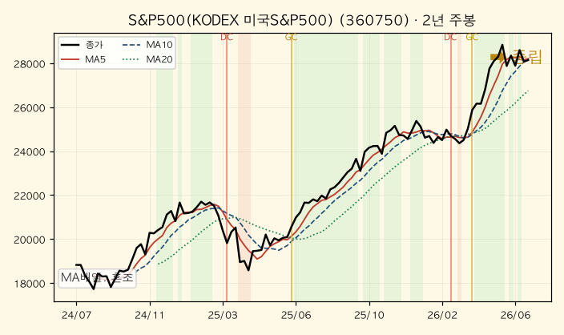
*S&P500 — 혼조(중립). 2년 +49.6%, 고저위치 93.8%. 고점권에서 MA5·MA10이 붙으며 숨고르기.*

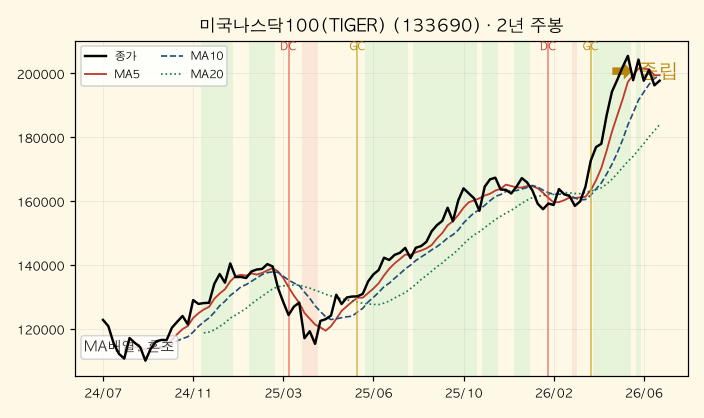
*나스닥100 — 혼조(중립). 2년 +61.0%, 고저위치 91.9%. 강세 흐름 속 단기 눌림.*

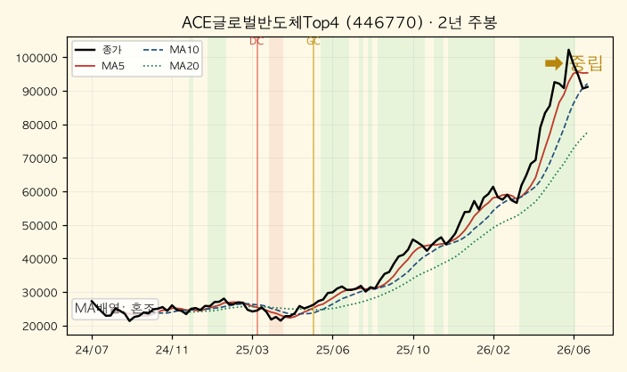
*글로벌반도체Top4 — 혼조. 2년 +234.7%(모멘텀 +82.8%). 장기 급등 후 고점권 변동성 확대.*

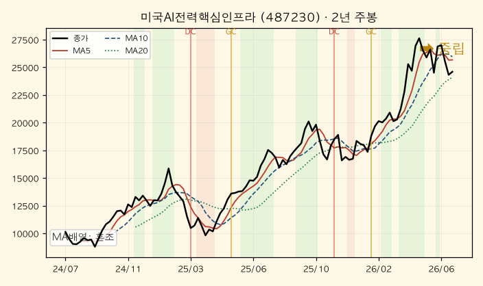
*AI전력핵심인프라 — 혼조. 2년 +142.9%. 상승추세 유지하나 최근 MA5 하회.*

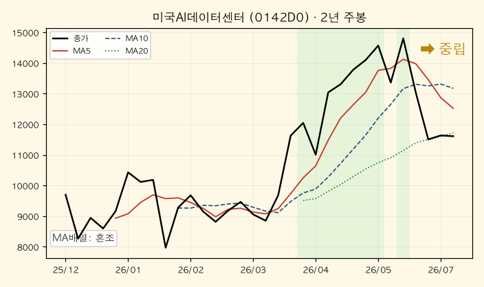
*AI데이터센터 — 혼조. 상장 이력 짧음(주봉 32개), 고저위치 53.3%로 중립 구간.*

**국내주식**

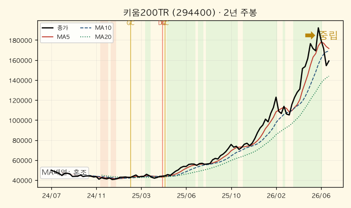
*키움200TR — 혼조. 2년 +219.1%(모멘텀 +97.7%). 국내 대형주 강한 상승 뒤 고점 다지기.*

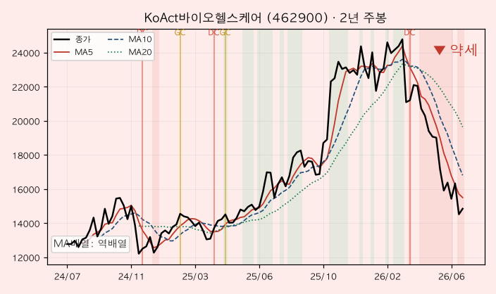
*바이오헬스케어 — 역배열(약세). 고저위치 21.0%, 일·주·월 전 축 약세 정합. 하락추세 지속.*

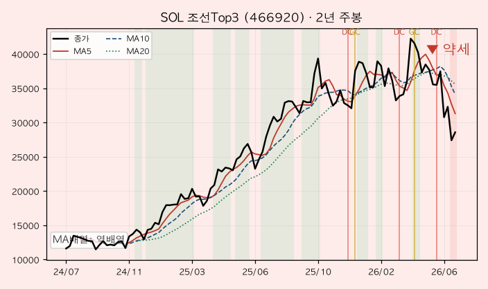
*조선Top3 — 역배열(약세). 2년 +146.3%지만 최근 DC 발생, 급등 후 조정 국면.*

**배당·인컴**

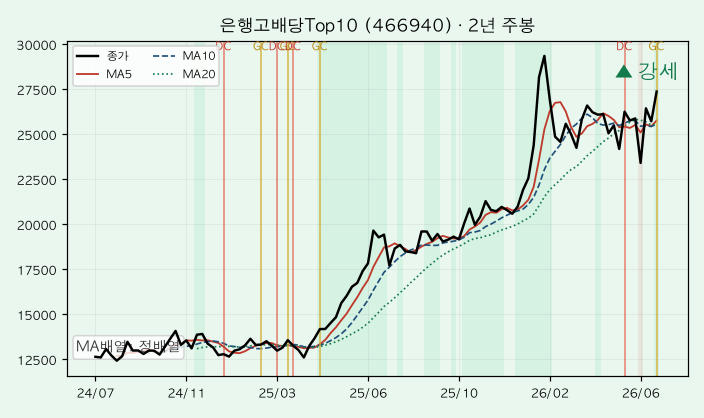
*은행고배당Top10 — **정배열(강세)**. 전 시간축 강세 정합, 주봉 GC. 가장 견고한 상승추세.*

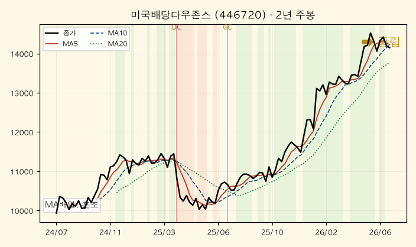
*미국배당다우존스 — 혼조이나 장기 우상향. 월봉 GC, 고저위치 91.9%.*

**혼합 / 채권**

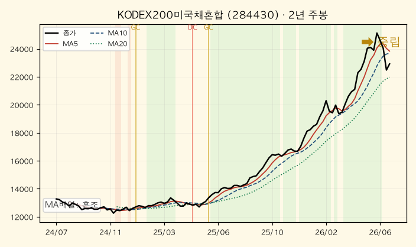
*200미국채혼합 — 혼조. 완만한 우상향, 변동성 낮음.*

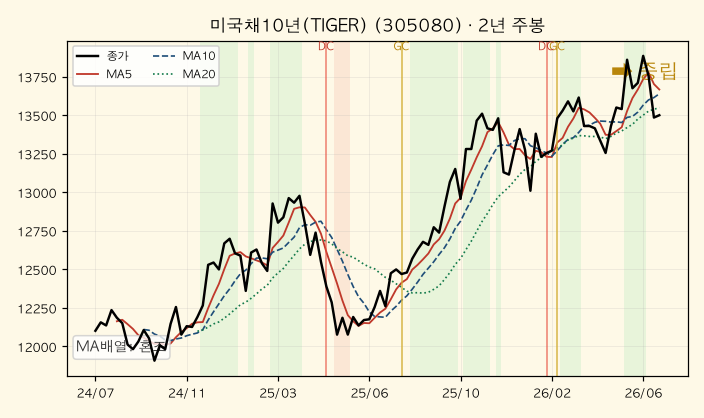
*미국채10년 — 혼조. 2년 +11.6%로 저변동. 고저위치 80.5%로 상단권.*

**대안자산**

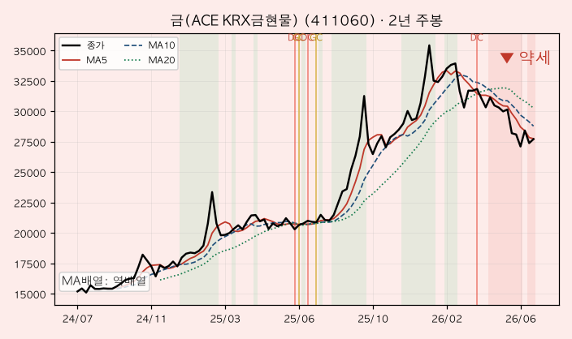
*금(KRX금현물) — 역배열(단기 약세). 2년 +82.4%로 장기 상승은 유지, 월봉은 중립. 최근 조정.*

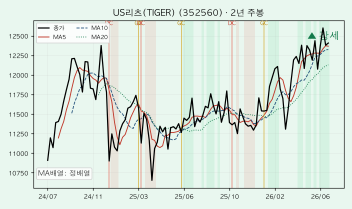
*US리츠 — **정배열(강세)**. 주봉 기준 안정적 우상향, 고저위치 90.1%.*

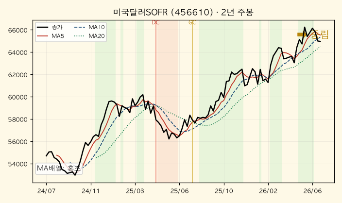
*미국달러SOFR — 혼조. 환율·캐리 반영해 완만 상승, 고저위치 90.4%.*

### [5] 추세추종 관점 주목 종목

| 구분 | 종목 | 근거 |
|---|---|---|
| 🚀 **멀티타임 정배열** | 은행고배당Top10 | 일·주·월 전 축 강세 정합, 주봉 GC, 고저위치 100% |
| 🚀 강세 우위 | US리츠(TIGER) | 주봉 정배열, 월봉 GC. 저변동 우상향 |
| ⚠️ **혼조·관망** | S&P500·나스닥100·반도체·AI전력·키움200TR | 장기 강세이나 단기 MA5 하회 → 고점권 눌림, 정배열 재전환 대기 |
| 🔻 **멀티타임 역배열** | 바이오헬스케어, 조선Top3 | 전 축 약세 정합. 바이오는 고저위치 3.9%(일봉) 바닥권, 조선은 DC 발생 |
| 📌 **눌림목 관찰** | 금(ACE KRX금현물) | 일·주봉 역배열이나 월봉 중립·장기 +170.9%. 추세 훼손 여부 확인 필요 |

### [6] 자산군별 추세 비교

- **선진국주식(미국·반도체·AI)** — 주봉 대부분 혼조지만 2년·5년 수익률이 압도적(반도체 5년 +951.7%, 나스닥 5년 +148.8%). 고저위치 80~97%로 **고점 부근에서의 숨고르기**로 읽는 게 타당하다.
- **국내주식** — 키움200TR은 강한 상승 뒤 다지기(중립)인 반면, **바이오·조선은 역배열 약세**로 갈렸다. 국내 안에서 성장·경기민감 → 배당·가치로 **스타일 로테이션** 조짐.
- **혼합·채권** — 200미국채혼합·미국채10년 모두 저변동 중립. 위험자산 변동성 확대 국면의 **완충재** 역할.
- **대안자산** — 금은 단기 역배열(조정)이나 장기 상승 유지, 리츠는 강세, 달러는 완만 상승. 서로 다른 국면이 섞여 **분산 효과**가 살아 있다.
- **배당·인컴** — 은행고배당이 전 자산군 통틀어 **가장 강한 추세**(정배열·GC). 인컴 자산으로 자금이 유입되는 흐름.

> 자산군 간 관계: **주식(고점 눌림) ↔ 채권(중립 완충) ↔ 금(단기 조정)**이 서로 다른 위상에 있어 포트폴리오 전체의 급변 위험은 제한적이다. 다만 국내 경기민감주(조선·바이오)의 약세가 뚜렷해, 위험선호가 **배당·은행·리츠 같은 인컴/방어형으로 이동**하는 신호로 해석된다.

### [7] 종합 코멘트

- **전체 방향성** — 큰 추세(월봉)는 여전히 **상승**이 지배적이나, 단기(일·주봉)는 다수 종목이 고점권에서 **혼조**로 전환됐다. "강세장 속 숨고르기"에 가깝다.
- **강세·약세 교차 신호** — 강세: 은행고배당·US리츠(인컴/방어). 약세: 바이오·조선(국내 경기민감), 금(단기). 즉 **성장·경기민감에서 배당·인컴으로의 로테이션**이 관찰된다.
- **추세추종 대응 방향** —
  1. **정배열(은행고배당·리츠)**: 추세에 편승 유지. MA5·MA10 지지선 유효한 한 보유.
  2. **혼조(미국주식·반도체·AI·키움200TR)**: 고점권 눌림. MA20 지지 확인하며 보유하되, **정배열 재전환 시 추가** 관점.
  3. **역배열(바이오·조선·금 단기)**: 추세추종에서는 **반등·정배열 재정렬 확인 전까지 신규 진입 자제**. 특히 조선·바이오는 하락추세가 진행형.

---

> ⚠️ **면책** — 본 분석은 이동평균선 기반 추세 판단으로 과거 가격 데이터에 근거하며, 미래 수익을 보장하지 않습니다. 특정 종목의 매수·매도 권유가 아니며 투자 판단과 책임은 투자자 본인에게 있습니다. 데이터는 Yahoo Finance 기준이며 실제 체결가·기준가와 차이가 있을 수 있습니다.

## 5. 내 ETF 평가 & 대응

> 안전마진 기반 가치투자자 관점에서 내 4개 계좌(연금저축펀드·개인IRP·퇴직연금·ISA)의 ETF를 평가하고, 앞의 세 분석(한국은행·거시·차트)을 종합해 대응·예측을 제시한다. **개인정보 보호를 위해 절대금액은 일절 표기하지 않으며, 계좌·종목 비중(%)과 종목 수익률(%), 정성 평가만 다룬다.** 시세(원)는 공개 시장 데이터이며 내 보유금액이 아니다. 데이터: Yahoo Finance 시세(2026-07-10 기준), 펀더멘털은 WebSearch·대표지수 추정.

### [5-0] 포트폴리오 스냅샷 — 무엇을 얼마나 담고 있나

먼저 "내 돈이 어느 바구니에 얼마나 담겨 있는지"를 비중으로 본다. 비중은 각 종목 평가금액을 전체 평가금액으로 나눈 값이다.

**계좌별 비중 (전체 자산 대비)**

| 계좌 | 비중 | 성격 | 한 줄 평 |
|---|---:|---|---|
| 퇴직연금 | 39.0% | 장기·세제혜택 | 가장 큰 계좌. 미국주식+혼합채권+금으로 균형 |
| 연금저축펀드 | 26.8% | 장기·세제혜택 | S&P500·금·은행배당 중심 |
| 개인IRP | 18.2% | 장기·세제혜택 | 혼합형(주식+채권) 비중 높아 방어적 |
| ISA | 16.1% | 중기·비과세 | AI·반도체·조선 등 테마·경기민감 집중 |

**자산군별 비중 (전체 자산 대비, 대분류)**

| 자산군 | 비중 | 세부 |
|---|---:|---|
| 주식(선진국) | 32.8% | S&P500 21.5% + 나스닥100 3.7% + 배당다우존스 6.8% + 버크셔 0.8% |
| 현금성/달러 | 15.0% | SOFR·달러단기채 (원금보존·캐리) |
| 혼합(주식+채권) | 14.8% | KODEX200미국채혼합·배당미국채혼합·삼전SK하이닉스혼합 |
| 금 | 13.5% | ACE/TIGER KRX 금현물 |
| 주식(국내) | 11.4% | 은행고배당 7.9% + 키움200TR 2.4% + 조선 1.2% |
| 주식(테마) | 10.5% | 반도체Top4 4.6% + AI전력 3.8% + AI데이터센터 2.1% |
| 채권 | 1.9% | 미국채10년선물 |

> **첫인상** — 주식이 약 55%(선진국+국내+테마), 금·채권·혼합·현금성이 약 45%. **한쪽으로 쏠리지 않은 균형 잡힌 자산배분**이다. 특히 금 13.5%, 현금성 15%는 지금처럼 "성장은 지속되나 인플레·레버리지가 과열된" 국면(거시분석의 4단계 late-cycle)에서 훌륭한 완충재다. 전체 평가/입금 기준 성과도 견조한 플러스 구간(대략 +18% 수준)으로, 안전마진 관점에서 무리한 포지션은 보이지 않는다.

### [5-1] 2단계 — ETF 지표 계산과 쉬운 설명

ETF는 여러 회사를 담은 '바구니'다. 그래서 지표는 바구니 안 기업들의 시가총액 가중평균으로 본다. 초보자용으로 각 지표가 무슨 뜻인지 먼저 정리한다.

- **PER(주가수익비율)**: 지금 주가가 "1년 버는 이익의 몇 배"인지. 20배면 이 회사를 통째로 사서 이익만으로 회수하는 데 20년 걸린다는 뜻. **낮을수록 싸다.**
- **PBR(주가순자산비율)**: 주가가 "회사 순재산(청산가치)의 몇 배"인지. 1배 미만이면 장부상 재산보다 싸게 거래되는 것.
- **이익수익률(1÷PER)**: PER을 뒤집은 값. "이 주식에 넣으면 이익 기준 연 몇 %가 내 몫인가". **은행 예금이자와 직접 비교할 수 있어 안전마진 판단의 핵심.**
- **배당수익률**: 주가 대비 1년에 현금으로 받는 배당 비율.
- **ROE**: 자기자본으로 얼마나 이익을 냈나(경영 효율). 높을수록 '돈 잘 버는 회사'.

**대표 종목 펀더멘털 (지수·바스켓 추정치)**

| 종목(자산군) | PER | PBR | 배당수익률 | 이익수익률(1÷PER) | ROE | 비고 |
|---|---:|---:|---:|---:|---:|---|
| 타이거 S&P500 (선진국) | 24.7배(후행)/20배(선행) | 약 4.9 | 약 1.2% | 4.0%/5.0% | 약 20% | 우량 대형주, ROE 최상 |
| 미국나스닥100 (선진국·성장) | 32.7배 | 약 7 | 약 0.7% | 3.1% | 매우 높음 | 성장 프리미엄 최대 |
| 미국배당다우존스(SCHD) | 약 18배 | 약 3 | 3.24% | 약 5.5% | 높음 | 질 좋은 배당, 이익수익률 양호 |
| 키움200TR·KODEX200 (국내) | 10~11배(선행) | 약 1.2 | 약 2% | 약 9~10% | 약 10% | 반도체 슈퍼사이클, 저평가 |
| 은행고배당Top10 (국내·배당) | 6~7배 | 약 0.6 | 약 6% | 약 15% | 약 10% | 초저PER·PBR<1, 배당 매력 |
| 글로벌반도체Top4·AI전력 (테마) | 30배+ | 높음 | <1% | 약 3% | 높음 | 성장 기대 선반영 |
| RISE 버크셔Top10 (가치) | 시장수준 | 중간 | 낮음 | 약 4~5% | 우수 | 버핏식 우량가치 바스켓 |
| 금·채권·SOFR·달러단기 | N/A(무이익) | N/A | 채권 이자 반영 | N/A | N/A | 이익지표 대신 금리·목표가로 판단 |

> **ETF를 회사로 보면(현금흐름)** — ① 영업활동: S&P500·반도체·나스닥100 안 기업들은 ROE 20% 안팎으로 '돈 버는 힘'이 강하다. ② 투자활동: 반도체·AI는 설비·R&D 투자가 커 미래 성장에 베팅(ROIC는 개별 미공개, N/A). ③ 재무활동: 은행고배당·SCHD는 배당·자사주로 주주환원이 두텁다. **주주환원(은행·SCHD)과 성장투자(반도체·AI)를 모두 담고 있어 현금흐름 성격이 분산돼 있다.**

### [5-2] 3단계 — 안전마진과 적정가격

**안전마진의 기준선: 한국 예금금리 약 3.5%.** 이익수익률(1÷PER)이 예금이자보다 높아야 "주식을 굳이 살 이유"가 생긴다. 낮으면 예금만 못하니 안전마진이 없는 것.

**이익수익률 vs 예금 3.5% (안전마진 진단)**

| 종목 | 이익수익률 | 예금(3.5%) 대비 | 안전마진 |
|---|---:|---|:---:|
| 은행고배당Top10 | 약 15% | +11.5%p | 🟢 매우 큼 |
| 키움200TR·KODEX200 | 약 9~10% | +6%p | 🟢 큼 |
| 미국배당다우존스 | 약 5.5% | +2.0%p | 🟢 양호 |
| S&P500(선행) | 5.0% | +1.5%p | 🟡 보통 |
| S&P500(후행) | 4.0% | +0.5%p | 🟡 얇음 |
| 나스닥100 | 3.1% | −0.4%p | 🔴 없음(예금 이하) |
| 반도체·AI테마 | 약 3% | −0.5%p | 🔴 없음(성장 의존) |

**종목별 적정가격 (현재가 대비, 공개 시세 기준)**

- **S&P500 (현재 28,160원, 후행 PER 24.7)**: 강력매수가 PER 20배 ≈ 22,800원(−19%) / 적정매수가 PER 25배 ≈ 28,500원(≈현재) / 정상화 매도구간 PER 22~25배. → **현재는 '적정매수' 상단, 강력매수는 아님. 이미 보유분은 홀드, 신규 대량진입은 부담.**
- **나스닥100 (현재 197,915원, PER 32.7)**: 이익수익률이 예금보다 낮아 가치투자 잣대로는 '비싸다'. 강력매수 PER 20배 환산 시 −39% 수준. → **추격매수 자제, 보유는 성장 프리미엄 감안해 유지.**
- **국내(키움200TR 159,605원·KODEX200)**: 선행 PER 10~11배로 이익수익률 9~10%, 예금의 3배. → **가치투자 관점 최고 매력, 눌림 시 분할매수 유효.**
- **은행고배당Top10 (27,390원)**: 배당수익률 5% 달성가가 강력매수가인데 현재 이미 배당 약 6%, PBR 0.6. → **가치·배당 모두 합격. 차트도 유일한 전축 정배열.**
- **금 (27,725원, 현물 spot $4,133/oz)**: 목표가 기준 — Goldman 2026말 $4,900(+18.5%) → 약 32,900원 / JP모건 Q4 $6,000(+45%) → 약 40,200원(환율 불변 가정). → **장기 상승 여력 유지, 단기 조정은 분할매수 기회.**
- **미국채10년 (13,500원)**: 듀레이션 약 8.5년. 금리 −1%p 인하 시 가격 +8.5% 안팎. 현재 10년물 4.49%. → **금리 고착 국면이라 즉각 상방은 제한, 인하 전환 시 레버리지.**
- **SOFR·달러단기채**: 원금보존형, 현재가 = 적정가. 캐리(이자)만 챙기는 '주차장'.

**S&P500 PER의 50년 맥락 (반드시 짚을 것)** — 지난 50년 S&P500의 평균 PER은 약 **16배**다. 지금 후행 24.7배는 장기 평균 대비 **+54% 프리미엄**이다. 역사적 극단과 비교하면: 닷컴버블 정점(약 44배)보다는 확실히 낮고, 코로나 직후(약 37배)보다도 낮지만, **금융위기 직전(약 20배)과 장기평균(16배)은 크게 웃돈다.** 즉 "거품은 아니되 역사적으로 비싼 구간"이다. 이익수익률 4%로 예금(3.5%)을 겨우 넘는 얇은 안전마진이 이를 뒷받침한다.

**마진데빗의 50년 맥락 (반드시 짚을 것)** — 거시분석대로 미국 마진데빗(빚내서 산 주식)은 **$1.42조로 사상 최고, 전년비 +53.7%**다. 이 속도의 급증은 지난 50년 중 **2000년·2007년·2021년(모두 폭락 직전 후기 사이클)에만** 나타났다. 초보자가 헷갈리는 대목: **"마진데빗이 늘 때가 아니라, 정점에서 꺾일 때가 진짜 경보"**다. 이유는 간단하다 — 빚으로 산 주식이 하락하면 증권사가 강제로 팔게 만드는 마진콜이 발동하고, 강제매도가 가격을 더 떨어뜨려 또 마진콜을 부르는 **연쇄 청산(도미노)**이 일어난다. 지금은 아직 증가 중이라 상승 연료지만, 이 연료가 바닥나는 순간 낙폭이 증폭된다. 그래서 내 금·현금성 45%가 '보험'으로서 의미가 크다.

### [5-3] 4단계 — 세 가지 투자자 관점

같은 ETF도 누구 눈으로 보느냐에 따라 매수·보유·매도 판단이 갈린다.

| 자산군(대표 종목) | 가치투자자 (버핏·안전마진) | 성장주 투자자 (ARK·테마) | 모멘텀 트레이더 (추세·마진데빗) |
|---|---|---|---|
| S&P500 | **보유** — 이익수익률 얇음, 신규 대량진입 자제 | **보유** — AI 실적 견인 지속 | **보유** — 혼조(고점 눌림), 정배열 재전환 대기 |
| 나스닥100 | **매도/축소** — 이익수익률<예금, 안전마진 없음 | **매수** — EPS 성장 최선호 | **보유** — 장기 강세 속 단기 눌림 |
| 국내(키움200TR·KODEX200) | **매수** — 선행 PER 10배, 최고 매력 | **매수** — 반도체 슈퍼사이클(+167% 수출) | **보유** — 급등 후 다지기(중립) |
| 은행고배당Top10 | **매수** — PBR 0.6·배당 6%, 안전마진 최대 | **보유** — 성장성은 낮음 | **매수** — 전축 정배열·GC, 최강 추세 |
| 미국배당다우존스(SCHD) | **매수/보유** — 이익수익률 5.5%·질 좋은 배당 | **보유** — 성장 제한적 | **보유** — 장기 우상향, 월봉 GC |
| 반도체Top4·AI전력 | **보유/경계** — 이익수익률 3%, 비쌈 | **매수** — 구조적 성장 테마 | **보유** — 고점권 변동성 확대 |
| 금 | **보유** — 무이표라 안전마진 잣대 밖, 인플레 헤지로 유효 | **보유** — 실물 대안 | **경계** — 일·주봉 역배열(단기 조정) |
| 채권·혼합(미국채10년·KODEX200미국채) | **매수/보유** — 인하 시 방어+상방 | **관심 없음** | **보유** — 저변동 완충재 |
| SOFR·달러단기채 | **보유** — 원금보존·캐리, 실탄 대기 | **관심 없음** | **보유** — 안정적 우상향 |
| ISA 조선Top3 | **매도/축소** — 수익률 마이너스, 저평가 근거 약함 | **보유** — 사이클 베팅 | **매도** — 전축 역배열·DC(하락추세) |
| ISA AI데이터센터 | **경계** — 유일한 마이너스(−14%), 안전마진 없음 | **보유** — 초기 테마 | **경계** — 상장 이력 짧고 모멘텀 −10.6% |

### [5-4] 5단계 — 종합 평가 및 예측 (안전마진 가치투자자 관점)

**세 분석의 종합 그림**
- **거시(분석3)**: 미국은 "성장 지속 + 인플레 재점화(헤드라인 PCE 4.1%) + 마진데빗 사상 최고"의 **4단계 과열 후기 사이클**. 금리 인하는 지연. 반면 **한국은 반도체 슈퍼사이클로 회복·확장기(3단계)**.
- **한국은행(분석2)**: 경상흑자 역대 최대·외환보유 안정으로 **대외건전성 최상**이나, 가계대출 급증이 금리 인하 여력을 제약.
- **차트(분석4)**: 큰 추세는 상승이나 단기는 고점권 **혼조(숨고르기)**. 강세는 **은행고배당·리츠(인컴/방어)**, 약세는 **조선·바이오(경기민감)와 금(단기)**. 성장→배당·인컴으로 **스타일 로테이션**.

**내 포트폴리오 종합 진단** — 세 분석을 겹쳐보면 내 자산배분은 이 국면에 **꽤 잘 맞춰져 있다.** 미국 과열 구간에 대비한 금(13.5%)·현금성(15%)·혼합/채권(16.7%)의 방어벽이 두껍고, 가장 저평가된 한국 자산(국내주식 11.4%·안전마진 큼)과 저평가 인컴(은행고배당 7.9%)을 이미 보유 중이다. 반면 안전마진이 없는 구간(나스닥100·반도체·AI테마 = 합계 약 14%)에 대한 노출도 존재한다.

**앞으로 이렇게 — 안전마진 우선 대응 지침**

1. **저평가·고안전마진은 눌림에 분할매수:** 국내(키움200TR·KODEX200, 이익수익률 9~10%)와 은행고배당(PBR 0.6·배당 6%). 거시(한국 확장기)·차트(은행 정배열)·안전마진 세 관점이 모두 합격하는 **유일한 삼각 일치** 구간이다.
2. **비싼 성장 테마는 신규 확대 금지, 비중 관리:** 나스닥100·반도체·AI(이익수익률 3% 이하, 예금 이하)는 성장 기대가 이미 가격에 실렸다. 보유분은 유지하되 **추격매수 금지**, ISA의 AI데이터센터(−14%)·조선(−6.6%)처럼 추세도 꺾이고 안전마진도 없는 종목은 반등 시 **비중 축소**가 정석.
3. **S&P500은 홀드, 강력매수는 −19% 눌림에서:** 후행 PER 24.7배(50년 평균 16배 상회)로 이미 '적정' 상단. 정액적립(연금 자동매수)은 이어가되 목돈 추가진입은 자제.
4. **방어 자산은 '보험'으로 유지·활용:** 금은 목표가(+18~45%) 여력 있어 단기 조정 시 분할매수. SOFR·달러단기채(15%)는 조정이 오면 저평가 자산을 살 **실탄**으로 대기. 미국채10년은 인하 전환 시그널(헤드라인 PCE 3%대 재하락) 확인되면 소폭 증량.

**조심하라 — 경계 신호**
- **마진데빗이 꺾이는 순간**(증가율 둔화·감소 전환)이 최대 경보. 그때는 위험자산 추가매수 중단, 현금성·금 비중 유지가 정답. 강제청산 연쇄로 낙폭이 커진다.
- **헤드라인 PCE 4%대 고착 또는 CPI 3.5% 초과(7/14·7/25 발표)** 시 연준 재긴축 → 나스닥·반도체·AI 등 고PER·저안전마진 종목이 가장 크게 흔들린다.
- 코스피 고점 조정·외국인 순매도 변동성 유의(한은 분석). 다만 저평가라 장기 훼손보다 눌림 기회로 해석.

> ⚠️ **면책** — 본 분석은 정보 제공 목적이며 투자 자문이 아니다. 펀더멘털은 공개지수·WebSearch 기반 추정치로 실제와 차이가 있을 수 있고, 시세는 Yahoo Finance 기준이다. 투자 판단과 책임은 본인에게 있다.

## 6. 종합 코멘트 & 다음 주 관전 포인트

**종합** — 네 갈래 분석이 한 그림으로 모인다. 미국은 성장을 유지하나 인플레·레버리지가 과열된 후기 사이클, 한국은 반도체가 끌어올리는 회복·확장기다. 시장 내부에서는 비싼 성장주에서 저평가 인컴·배당으로 무게가 옮겨가는 중이다. 안전마진 관점의 결론은 명확하다: **싸고(이익수익률이 예금 3.5%를 크게 웃도는) 안전마진이 큰 자산(국내 대표지수·은행고배당)은 눌림에 사 모으고, 안전마진이 없는 고PER 성장·테마(나스닥100·반도체·AI)는 추격하지 않으며, 금·현금성은 과열 반전에 대비한 보험으로 유지**한다.

**다음 주 관전 포인트**
- **미국 CPI(7/14 예정)·Core PCE 흐름** — 헤드라인 인플레가 4%대에서 고착되거나 CPI가 3.5%를 넘으면 연준 재긴축 우려로 고PER 종목이 흔들린다.
- **마진데빗 방향** — 증가율이 둔화·감소로 꺾이는 순간이 최대 경보(강제청산 연쇄). 방향 전환 시 위험자산 추가매수 중단.
- **코스피 수급** — 사상 최고 부근 외국인 순매도·변동성. 저평가라 훼손보다 눌림 매수 기회로 해석하되 변동성 유의.
- **한국 가계대출·매크로건전성 규제** — 인하 기대를 후퇴시키는 변수. 금리 민감 자산(채권·리츠)에 영향.

*(이번 주 발표 예정 지표의 상세 일정·체크포인트는 위 3. 거시지표 분석 STEP 9 표 참조.)*
