## 1. 이번 주 요약

이번 주는 한국은행 기준금리 인상(2.50% → 2.75%)과 미국 경기 둔화 신호가 주요 뉴스였습니다. 한국은 반도체 수출 호조로 성장률을 상향 조정했으나, 인플레이션 고착화로 금리 인상 추세가 지속될 전망입니다. 미국은 LEI 약화와 ISM PMI 부진으로 경기 둔화 신호가 강화되고 있으며, 마진데빗 극고점으로 시장 조정 위험이 높아지고 있습니다.

**경기 국면 선언**: 현재는 2단계(금리 인하기 초입) 진입 초기 국면이며, 핵심 변수는 중동 지정학과 중국 경기입니다. 한국 금융주 강세(금리 인상 수혜)와 미국 자산 방어(금리 인하 영향) 구도가 진행 중입니다.

## 2. 한국은행 보도자료 분석

### 주요 보도자료 개요 (2026년 7월 19-25일)

이번 주 한국은행은 중앙은행 정책 결정과 경제 평가를 담은 핵심 보도자료 5건을 발표했다. 반도체 수출 호조로 성장 모멘텀이 확대되는 한편, 인플레이션 압력이 지속되면서 통화정책 긴축 기조가 강화되는 시점이다.

---

### 1. 통화정책방향 결정 (2026.7.16) ★ 최우선

**기준금리 인상 결정**
- **인상폭**: 2.50% → 2.75% (0.25%p 인상)
- **투표**: 금융통화위원회 7인 만장일치 의결

**인상 판단 근거**
- 반도체 수출 중심의 성장 모멘텀 확대
- 목표(2%) 이상의 인플레이션 압력 지속
  - 소비자물가: 6월 3.2% (유가·농산물 가격 상승)
  - 핵심 인플레이션: 2.5% (비용 충격 전이)
- 금융안정 리스크 상존 (가계대출 증가, 부동산 가격 상승)

**향후 전망 및 시사점**
- 금융통화위원회는 "향후 금리는 상승 추세 유지 필요"라고 명확히 표현
- **투자자 영향**: 추가 인상 가능성 높음 → 고금리 장기화 시그널
- 2026년 통화정책 사이클: 긴축 심화 단계

---

### 2. 경제상황 평가 (2026.7월)

**성장 전망 상향**
- 반도체 경기 호조와 투자 확대로 국내 경제 성장세 확대
- 2026년 성장률: 5월 전망(2.6%) 대비 **상향 조정 예상**
- 중동 지정학적 불확실성 지속에도 성장 견인력 충분

**물가 고착화 우려**
- 소비자물가: 3.2% (6월) → 고위험 수준 지속 전망
- 선행 요인들
  - 유가 상승
  - 농산물 가격 상승
  - 수요 압력 확대 (경기 개선으로)
  - 비용 충격의 실물 경제 전이
- **핵심 인플레이션**: 2.5% (대기 중인 상향 압력)

**금융시장 신호들**
- 원/달러 환율: 1,400~1,500원 범위 변동 (변동성 확대)
- 서울 주택가격: 상승세 지속
- 가계대출: 상당한 증가세 (금리 인상 시 부담 가중)

---

### 3. 금융기관 대출행태 서베이 (2026년 2/4분기 결과, 3/4분기 전망)

**기업대출 태도 전망**
- **대기업**: 완화 방향으로 전환
- **중소기업**: 전 분기 수준 유지 전망
  - 신용도 격차 심화 추세 계속

**가계대출 동향**
- 상세 내용: 수집 불가
- 참고: 한국은행 발표에서 가계대출 증가 강조

**해석**
- 기업 간 신용 차등화 심화로 양극화 구조 지속
- 금리 인상 환경에서 중소기업 차입 여건 악화 우려

---

### 4. 신현송 총재 EMEAP 회의 참석 (2026.7.21 공지)

**회의 일정**
- **개최기간**: 2026.7.22(수)~7.24(금)
- **개최지**: 싱가포르
- **주최 기관**: 동아시아·태평양 중앙은행총재회의(EMEAP)

**회의 구성**
- 제31차 EMEAP 총재회의
- 제15차 EMEAP 중앙은행총재·금융감독기구수장 회의

**신현송 총재 일정**
- 출국: 7.22(수)
- 귀국: 7.25(토)

**국제 협력 시사점**
- 글로벌 금리 인상 기조 공조 가능성 점검
- 한국 금융통화위원회의 인상 결정, 국제 정책 방향과 일치하는 신호

---

### 5. 한국은행원화국제결제망(BOK Wire) 구축 진행상황 (2026.7.21)

**발표 개요**
- 2026년 7월 21일 공식 발표
- 한국은행 국제 결제 인프라 현대화 프로젝트

**상세 내용**
- 수집 불가 (공식 보도자료 전문 미수집)

**전략적 함의 (배경 지식)**
- 원화 국제화 전략의 일환
- 금융 시스템 효율성 강화
- 중장기 금융 경쟁력 제고

---

### 종합 분석: 안전마린 관점의 투자 함의

**핵심 메시지**
한국은행의 이번 주 정책 기조는 **인플레이션 관리와 금융안정 강화**이다. 반도체 수출 호조로 실물 경제는 개선되고 있으나, 물가 고착화와 금리 인상 장기화로 인한 구조적 압력이 증대되는 분기점이다.

**투자자 체크리스트**

1. **포트폴리오 금리 민감도 점검**
   - 고금리 환경 장기화 가정
   - 채권 및 고배당주 비중 재조정 필요
   - 유동성 유지의 중요성 확대

2. **기업 선택의 기준 재정의**
   - 우대 기준: 높은 현금 창출력, 낮은 차입 의존도, 원가 전가 능력
   - 주의 대상: 과도한 차입, 고금리 환경에 취약한 업종, 중소기업

3. **가계 자산 포트폴리오의 재평가**
   - 부동산 가격 상승세 지속 여부 재검토
   - 변동성 확대(원화 약세)에 대한 환헤지 고려
   - 현금 및 단기 자산의 유보율 확대

4. **지정학적 리스크 헤징**
   - 중동 불확실성 지속 → 에너지 상품 변동성
   - 글로벌 금리 인상 기조에 따른 신흥국 자본 이탈 우려

**결론**
반도체 호조는 긍정적이나, 인플레이션과 금리 인상의 이중 압력이 본격화되는 시점이다. 안전마진을 충분히 확보하고, 경기 둔화 시나리오에 대비한 포트폴리오 재조정이 필요하다.

## 3. 거시지표 분석

### [STEP 1] 최신 수치 수집

| 지표명 | 최신값 | 이전값 | 전월비/전주비 | 발표일 | 출처 |
|---|---|---|---|---|---|
| 미국 경기선행지수 (LEI) | 99.1 | 99.0 | -0.2% | 2026-07-20 | Conference Board |
| 한국 경기선행지수 (CLI) | 102.28 | 102.15 | +0.13pp | 2026-03-31 | OECD/통계청 |
| ISM 제조업 PMI | 53.3 | 54.0 | -0.7pp | 2026-07-01 | ISM |
| ISM 제조업 가격지수 | 73.0 | 82.1 | -9.1pp | 2026-07-01 | ISM |
| ISM 제조업 고용지수 | 49.7 | 48.6 | +1.1pp | 2026-07-01 | ISM |
| ISM 제조업 신규주문지수 | 56.0 | 56.8 | -0.8pp | 2026-07-01 | ISM |
| NAHB 주택시장지수 | 34 | 36 | -2 | 2026-07-16 | NAHB |
| 신규 실업수당 청구건수 | 187K | 209K | -22K | 2026-07-18 | DOL |
| 연속 실업수당 청구건수 | 1,796K | 1,798K | -2K | 2026-07-18 | DOL |
| Core PCE (전년비) | 2.8% | (예상 발표 예정) | - | 2026-06-30 | BEA |
| Core PCE (전월비) | 0.3% | - | - | 2026-06-30 | BEA |
| 헤드라인 PCE (전년비) | 2.9% | - | - | 2026-06-30 | BEA |
| 미국 소비자신뢰지수 | 54.4 | 50.5 | +3.9pp | 2026-07-17 | Conference Board |
| 미국 10년물 국채금리 | 4.71% | 4.56% | +15bp | 2026-07-24 | FRED |
| 미국 2년물 국채금리 | 4.35% | (7월 중순 4.21%) | - | 2026-07-24 | FRED |
| 10년-2년 스프레드 | 36bp | 35bp | +1bp | 2026-07-24 | FRED |
| 10년-3개월 스프레드 | 양(+) | 양(+) | 정상 | 2026-07-24 | FRED |
| 미국 마진 데빗 | $1.53T | $1.42T | +7.9% MoM, +51.5% YoY | 2026-06-30 | FINRA |
| WTI 유가 | $87.88 | $86.50 | +$1.38 | 2026-07-24 | EIA |
| 미국 원유 생산량 | - | - | 수집 불가 | - | EIA |
| SCFI 상하이 컨테이너 운임 | 3018.26 (6월 평균) | - | 고점 3239.64 | 2026-06-30 | KCLA |
| 미국 재고/매출 비율 | 1.28 (5월) | 1.29 (4월) | -0.01 | 2026-07-01 | Census |
| 한국 산업생산 YoY | 3.1% (5월) | 2.6% (4월) | +0.5pp | 2026-06-30 | 통계청 |

---

### [STEP 2] 지표별 심층 해석

#### 1. 미국 경기선행지수 (LEI)

**개요:** LEI는 미국 경기의 선행 신호를 6~9개월 앞서 제시하는 종합 지수(2016=100 기준).

**현재 상황:** 
- 6월 LEI 99.1 (2016 기준), 전월 대비 0.2% 하락
- 반등세 한 달 만에 다시 약세: 5월 +0.1%, 6월 -0.2%
- 연초 대비 -0.3%로 약한 둔화 신호

**강도 평가 (🟡 약한 경고):**
- 2024년 평균 대비 2.4% 낮음 (역사적 평균 기준 약세)
- 6개월·12개월 성장률 모두 음수이지만 안정적 → 급락이 아닌 둔화 추세
- 제조업 약세 + 건설허가 감소 + 약한 소비심리가 주요 약점

**시그널:** 향후 2분기(8~11월) 경제 모멘텀 약화 신호. 그러나 AI 투자 및 강한 기업 자본지출이 낙폭을 제한 중.

---

#### 2. ISM 제조업 PMI 및 세부지수

**개요:** ISM PMI는 50이 확장/수축 분기선. 세부지수는 신규주문·가격·고용·수입 등 6개 항목.

**전체 PMI:**
- 6월 53.3% (5월 54.0%), 0.7pp 하락
- 6개월 연속 확장, 하지만 모멘텀 약화 중
- 2024 평균 48.2% 대비 5.1pp 위 → 강한 확장 상태 유지

**세부 해석:**

**신규주문 지수 56.0% (5월 56.8%, -0.8pp)**
- 4개월 수축 후 6개월 연속 회복 중
- 50 대비 +6pp → 약한 회복이지만 지속적 수요 신호
- AI 관련 투자 · 재고 보충 수요가 버팀목

**가격지수 73.0% (5월 82.1%, -9.1pp)**
- 큰 폭 하락 → 인플레 압력 급완화 신호
- 역사적 평균(62.3%) 대비 여전히 높음
- 원자재·에너지 가격 상승세에 부분 제약 가능

**고용지수 49.7% (5월 48.6%, +1.1pp)**
- 수축 직전 수준(50 근처) → 고용 심화 약화 신호
- 기업의 신규채용 미온적 태도 시작
- 앞으로 1~2개월 신규 실업수당 상승 가능성

**시그널:** 제조업 확장은 유지되나, 신규주문·가격·고용 모두 약화 추세. 경기 정점 후 서서히 하강하는 신호로 해석 가능.

---

#### 3. 신규 실업수당 청구건수

**개요:** 주간 발표, 현재 고용시장 강도와 기업의 고용/감원 의사를 즉시 반영.

**최신값:**
- 187K (7월 18일 주간) — 50년 만의 최저치 근처
- 이전주 209K 대비 22K 감소
- 예상치 212K를 크게 하회

**강도 평가 (💚 매우 강함):**
- 역사적 평균(약 260K) 대비 28% 낮음
- 4주 이동평균 196K (안정적 저수준 지속)
- 경기 침체 임계값(400K~500K) 대비 60% 낮음

**시그널:** 여름 시즌 요인 제외하면 실제 노동시장 매우 강함. FOMC 성명서 "완전고용" 지지 근거. 급등세 시작까지 고용 자산 방어 신호.

---

#### 4. Core PCE 및 인플레이션

**개요:** Fed 목표금리 결정의 핵심 기준. 전년비·전월비 구분.

**6월 발표값:**
- Core PCE 전년비 2.8% (5월 2.9%, -0.1pp)
- Core PCE 전월비 0.3%
- 헤드라인 PCE 전년비 2.9% (5월 3.0%)

**강도 평가 (🟢 안정):**
- Fed 목표 2% 대비 +0.8pp (약간 높지만 하향 추세)
- 2024년 평균(약 2.8%) 거의 동일 수준
- 최근 3개월 추세 뚜렷한 하향 → 인플레 냉각 신호

**시그널:** 인플레 둔화가 명확함. 8월 PCE 데이터로 금리인하 신호 강화 가능. 유가 급등(7월 후반 $87~89)이 8월 가격에 부분 반영 가능.

---

#### 5. 미국 소비자신뢰지수

**개요:** Conference Board & UoM 두 지표. 현재상황 vs 6개월 기대 괴리.

**7월 UoM 지수 54.4** (5월 50.2 → 6월 50.5, +3.9pp)
- 역사평균(약 66) 대비 17.6pp 하회 (약세 심각)
- 그러나 2개월 연속 반등 → 심리 개선 추세
- 휘발유 가격 인하 · AI 낙관론 자극

**세부 분석:**
- 현재상황 지수: 54.9 (4월 47.7 대비 상승)
- 기대 지수: 54.0 (안정적)
- 물가기대 1년: 4.2% (6월 4.6%)
- 물가기대 5년: 3.3% (안정)

**강도 평가 (🟡 약한 개선):**
- 절대값 54.4는 여전히 "약세" 지표
- 하지만 반등 추세 자체가 위험 자산 지원 신호
- 자동차 구매욕 20% 상승 → 내구재 수요 회복

**시그널:** 소비심리가 최악에서 회복 중이나 여전히 약함. 금리인하 시작 시 소비 밑받침 가능성.

---

#### 6. 장단기 금리 스프레드

**개요:** 정상 곡선(10년>2년) 여부 = 경기 신뢰도 판정 기준.

**미국 (10년-2년 스프레드):**
- 7월 24일: 36bp (10년 4.71%, 2년 4.35%)
- 6월: 35bp
- 상태: **정상 양의 곡선** 지속

**강도 평가 (🟢 긍정):**
- 역전 없음 → 경기 침체 신호 부재
- 단 36bp는 역사적으로 "얇은" 범위 (평상시 80~120bp)
- 지난 6개월 5~50bp 범위 진동 → 미묘한 불안정성

**시그널:** 금리인하 기대가 2년물 상승 제약 중. 금리인하 시 스프레드 확대 가능성. 현재 역전 위험 낮음.

---

#### 7. 미국 마진 데빗 (레버리지)

**개요:** 투자자들이 증거금 대출로 빌린 자금 규모 = 시장 과열도의 핵심 지표.

**6월 수치:**
- $1.53조 (신기록)
- 5월 $1.42조 대비 +7.9% (월간 수준으로 매우 가파름)
- 전년 동월 대비 +51.5% (2025년 6월 대비)

**강도 평가 (🔴 과열 경고):**
- 2021년 최고점($912B) 대비 67.8% 상승
- 지난 12개월 대폭 상승 추세 = 과도한 레버리지 축적
- 마진 역사 최고점 경신 → 조정 위험 단계

**시그널:** 마진데빗이 높을수록 지수 조정 시 증거금 추심(forced selling) 위험 높음. 현재 수준은 "상단" 진입 단계. 금리인하 지연 시 유동성 압박 가능.

---

#### 8. WTI 유가

**개요:** 경기 · 인플레 · 지정학 3중 신호 지수.

**7월 후반:**
- 7월 24일: $87.88/bbl
- 7월 23일 최고: $88~89 (주간 고점)
- 7월 초: $81~85 레인지

**급등 원인:**
- 이란-미국 분쟁 악화
- 중동(호르무즈 해협) 선박 공격
- 카자흐스탄 드론 공격 → 수출 중단

**강도 평가 (🟠 주의):**
- $100 이상이 아니므로 심각하지 않음 (2022년 고점 $120 대비)
- 하지만 주간 상승률 5~7% = 급변동 신호
- $90 돌파 시 인플레 재가열 우려

**시그널:** 지정학 리스크 고조. 7월 후반 에너지 가격 상승이 8월 물가에 영향. 향후 2주 중동 긴장도가 핵심 변수.

---

#### 9. SCFI (상하이 컨테이너 운임)

**개요:** 해상 운임 = 글로벌 무역 부하 실시간 온도계.

**6월 데이터:**
- 평균 3,018.26 포인트
- 범위: 최저 2,726.48 ~ 최고 3,239.64

**강도 평가 (🟡 중립):**
- 2024년 평균(약 1,500) 대비 2배 이상 → 운임 상승 추세
- 그러나 2025년 평균(약 3,200~3,500) 대비 약간 낮음 → 거래량 모멘텀 약화
- 중국 수출 약세 신호

**시그널:** 글로벌 수입 수요 약화 신호. 중국 경기 둔화 반영. 향후 3개월 수출 모멘텀 약화 예상.

---

#### 10. 한국 산업생산 YoY

**개요:** 제조·광업·전기 생산 전년 동월 대비. 한국 경기 직접 신호.

**5월 최신값:**
- 3.1% YoY (4월 2.6% 대비 +0.5pp)
- 회복 추세 시작

**강도 평가 (🟡 약한 회복):**
- 2024년 평균(약 2.5%) 대비 약간 위
- 3% 수준은 "약한 확장" (강한 확장은 5% 이상)
- 반도체·자동차 수출 상황에 직결

**시그널:** 한국 경기 약한 회복 중. 다만 6월 지정학 악화(반도체주 급락) 고려하면 7월 재급락 가능성.

---

#### 11. 미국 소비자신뢰 & 현재상황 괴리

**UoM 분석:**
- 현재상황 지수: 54.9
- 기대 지수: 54.0
- 괴리: +0.9pp (거의 같음)

**해석:** 일반적으로 기대가 현재보다 낮으면 (현재 > 기대) 경제 반등 신호. 현재 둘이 동등하면 "답보" 신호. 심화 침체 우려는 낮음.

---

#### 12. 미국 재고/매출 비율

**개요:** <1.3이면 강한 수요, >1.5면 재고 과잉 신호.

**5월 최신값:**
- 1.28 (4월 1.29 대비 -0.01)
- 2021년 후반 이후 최저 수준

**강도 평가 (🟢 강한 수요):**
- 목표 수준(1.25~1.35) 상단 근처
- 비율 하락 = 판매 가속 신호 (기업들이 재고 확보에 나서지 않음)
- 공급망 정상화 + 수요 강세 신호

**시그널:** 소비 강세 여전함. 향후 기업의 재고 투자 회복 가능 (긍정).

---

### [STEP 3] 경기 온도계 종합 진단

#### 🇺🇸 미국 경기 상황

| 분야 | 지표 | 강도 | 신호 |
|---|---|---|---|
| **제조업** | ISM PMI 53.3% | 🟡 약한 확장 | 신규주문 회복 + 가격 급완화 |
| **고용** | 신규청구 187K, 고용지수 49.7% | 💚 강함 | 노동시장 강하나 채용 심화 약화 신호 |
| **물가** | Core PCE 2.8%, 가격지수 73% | 🟢 안정 | 명백한 인플레 둔화 추세 |
| **주택** | NAHB 34, 가격인하 37% | 🔴 약함 | 연속 27개월 50 이하 (극도로 약함) |
| **소비심리** | UoM 54.4, +3.9pp | 🟡 약한 개선 | 최악에서 회복 중이나 여전히 약함 |
| **금융여건** | 마진 $1.53T, +51.5% YoY | 🔴 과열 | 레버리지 극고점 (조정 위험) |
| **에너지** | WTI $87.88, 지정학 악화 | 🟠 주의 | 공급 위험 상승 중 |
| **공급망** | SCFI 3018, 재고/매출 1.28 | 🟡 중립 | 수입 약세 + 내수 재고 정상 |

**종합 진단:** 미국 경기는 **제조업 약화 + 강한 고용 + 안정 물가 + 극도의 주택 약세 + 과도한 레버리지**의 혼합 신호. 금융조건 다소 완화되고 있으나, 마진 극고점과 주택 약세가 향후 2분기 조정 위험 상회.

---

#### 🇰🇷 한국 경기 상황

| 분야 | 지표 | 강도 | 신호 |
|---|---|---|---|
| **선행지수** | CLI 102.28 (3월) | 🟡 중립 | 데이터 시차 크지만 약한 신호 |
| **산업생산** | 3.1% YoY (5월) | 🟡 약한 회복 | 반도체 수출에 의존 |
| **수출** | 외국인 -160조원 (연초~7월) | 🔴 약함 | 반도체 약세에 외인 대거 탈출 |
| **금리환경** | 스프레드 양(+), 구체값 미발표 | 🟡 중립 | 역전 없음 |
| **지표 품질** | 6월 자료까지만 발표 | 🟠 주의 | 현재 7월 후반 = 후행지표 의존 |

**종합 진단:** 한국 경기는 **약한 산업생산 + 반도체 수출 극도의 약세 + 외인 대거 탈출**로 경기 약세 명확함. 특히 7월 후반 반도체주 급락(삼성전자·SK하이닉스)이 경기 약화 신호 강화.

---

### [STEP 4] 경기 사이클 위치 진단 (4단계)

#### 현재 판단: **2단계 금리 인하기 초입 전환 신호**

**근거 (지표 3개 이상):**

1. **LEI 약화 (-0.2% 6월)** → 6~9개월 경기 둔화 신호 (1단계 긴축 말기 특성)
2. **ISM 신규주문 회복 중 (56%)** → 기업 투자 아직 유지 (2단계 진입 신호)
3. **Core PCE 2.8% 둔화** → 금리인하 정당성 부각 (2단계 초입 신호)
4. **고용지수 49.7% (수축권 진입)** → 2단계 후반 특성 (금리인하 → 일자리 보호)
5. **마진데빗 극고점** → 1단계 말 시장 과열의 전형

**해석:** 미국은 현재 **1단계 말~2단계 초입**의 전환점. 경기 정점은 통과했으나 고용 · 소비심리는 아직 버팀목. 향후 4~8주 내 "첫 금리인하" 신호 시 2단계 확정. 한국은 1단계 후반 진입(제조업 약세).

**다음 단계 전환 조건:**
- **2→3단계 (회복·확장기):** Fed 금리인하 개시 + ISM PMI 50 이상 유지 + 신규청구 안정 + 마진 감소세 전환
- **3→4단계 (과열):** PCE 3.5% 이상 재가열 OR 마진 재급등 + ISM 55 이상

---

### [STEP 5] 미국 vs 한국 경기 온도 비교

| 구분 | 미국 | 한국 | 판정 |
|---|---|---|---|
| **성장 모멘텀** | 약한 양(+) — ISM 53, 신규주문 회복 | 약한 양(+) — 산업 3.1% | 약세 동반 |
| **물가/금융** | 안정 — PCE 2.8% (정상화) | 안정 — 물가 발표 미구체 | 동일 |
| **고용/투자** | 강함 — 청구 187K (극저) | 약함 — 제조 채용 위축 우려 | 미국 우 |
| **시장 심리** | 과열 — 마진 $1.53T | 약함 — 외인 탈출 -160조 | 기울어짐 |
| **수출의존도** | 낮음 (내수 중심) | 높음 (반도체 수출 중심) | 한국 취약 |
| **통화정책** | 금리인하 단계 진입 예상 | 기준금리 정상화 추세 | 미국 완화 선 |

**디커플링 여부:** **부분적 디커플링** — 한국 반도체 약세가 심각하나, 미국 대형주 IT도 부분 약화 중 (AI 투자 이외). 다만 미국은 금리인하 기대, 한국은 정상화로 통화정책 방향이 반대.

**자산배분 시사점:**
> **약세 국면에서 상이한 통화정책 → S&P500 선호 (금리인하 수혜) · 코스피 축소 (외인 탈출 + 반도체 약세) · 한국 채권 매력도 상승 (인상기 종료 신호)**

---

### [STEP 6] 인플레이션 및 실질금리 환경 평가

#### 인플레이션 국면: **둔화 추세 진입**

**근거:**
- Core PCE 2.8% (6월) — 전월 2.9%, 올초 3.1% 대비 명확한 하향
- ISM 가격지수 73% (6월) — 82.1% (5월) 대비 9.1pp 폭락
- 헤드라인 PCE 2.9% — 에너지 제외하면 더 안정적
- 소비자물가기대 1년 4.2% (6월 4.6%) — 심리 안정화

**국면 판정:** Fed 목표(2%)로의 완만한 복귀 경로. 일시적 상승(유가 지정학) 가능하나 추세는 하향.

---

#### 실질금리 계산 & 해석

**공식:** 실질금리 = 명목금리(10년 4.71%) − 기대인플레(Core PCE 2.8%)
- **실질금리 ≈ 1.91%**

**해석:**
- 양수(+) = 실질로 자산가 아직도 "비싼" 상태 유지
- 2024년 초 실질금리 3.5% 대비 1.5pp 하락 (다소 완화)
- 역사평균(약 1.5%) 대비 약간 위 = "정상" 범위 상단

**자산별 유불리:**

| 자산 | 평가 |
|---|---|
| **주식** | 실질금리 양수 → 여전히 추가 완화 여지 있음. 금리인하 시 매력도 ↑ |
| **채권** | 실질금리 낮아짐 → 캐리 수익률 저하 예상. 단 금리인하 심화 시 가격상승 가능 |
| **금** | 실질금리 1.91% = 금 약한 약세. 그러나 지정학 리스크 + 달러 약화 → 방어 수요 |
| **달러** | 실질금리 하락 = 상대적 매력도 하락 (엔/유로 대비) |

---

#### 금(Gold) 매력도

**현재 COMEX 금 가격:** $5,035.40/oz (7월 29일 계약)

**평가 (🌟🌟🌟 3/5 - 중립~약한 약세):**

**약세 요인:**
- 실질금리 +1.91% (양수 = 금 비수익 자산으로 상대적 약점)
- 달러 강세 기조 (금리인상 전망 > 인하)

**강세 요인:**
- 지정학 불안정 (이란-미국 분쟁, 호르무즈 해협 위협)
- 글로벌 통화 불안정성 (선진국 금리인하 전환)
- 중앙은행 금 축적 (공급 수요 불균형)

**종합:** 현재는 방어적 중립 수준. 금리인하 가속 + 지정학 위험 심화 시 급등 가능(타겟 $5,200~$5,400). 반대로 달러 강세 지속 시 하락 위험($4,800~$4,900).

---

### [STEP 7] 레버리지 및 시장 과열 진단

#### 7-1. 마진 데빗 & 금리 스프레드

| 지표 | 수치 | 강도 | 신호 |
|---|---|---|---|
| **마진 데빗** | $1.53T | 🔴 극고점 | +51.5% YoY, 신기록 경신 |
| **10-2년 스프레드** | 36bp | 🟢 정상 | 역전 없음, 얇지만 양(+) |
| **종합 진단** | - | 🔴 과열 | 금리 완화로 마진 축적, 조정 위험 높음 |

**해석:** 마진 극고점 + 금리 스프레드 정상 = "시장이 여전히 과열되어 있으나, 경기 침체 우려는 낮은" 상황. 금리인하 시작 → 마진 더 증가 가능 → 조정 시 증증거금 추심 위험.

---

#### 7-2. 시장 과열 지표 (최근 3년 데이터)

##### **1. 지수 대비 대장주 비중**

###### 미국 (S&P500 vs Magnificent 7)

| 기간 | 비중(%) | 신호 |
|---|---|---|
| **2024-Q3** | ~28% | 정상 |
| **2024-Q4** | ~30% | 주의 |
| **2025-Q1** | ~32% | 주의 |
| **2025-Q2** | ~31% | 주의 |
| **2025-Q3** | ~33% | 주의 |
| **2025-Q4** | ~35% | 경고 |
| **2026-Q1** | ~36% | 🔴 경고 |
| **2026-Q2 (6월)** | ~34-35% | 🔴 경고 |
| **2026-07 (최근)** | ~34% | 🔴 경고 |

**개별 가중치 (7월):**
- **NVIDIA:** ~7.5% (단일 종목 최대)
- **Microsoft, Apple, Alphabet:** 각 ~4~5%
- **Amazon, Tesla, Meta:** 각 ~2~3%

**해석:** >30% 지속 = 시장 쏠림 신호. NVIDIA 단독 7.5%는 개별 종목 최고 수준 → AI 거품 리스크 시사.

---

###### 한국 (KOSPI vs 삼성전자·SK하이닉스)

| 기간 | 비중(%) | 신호 |
|---|---|---|
| **2024-Q3** | ~23% | 정상 |
| **2024-Q4** | ~27% | 주의 |
| **2025-Q1** | ~32% | 경고 |
| **2025-Q2** | ~38% | 🔴 경고 |
| **2025-Q3** | ~42% | 🔴 과열 |
| **2025-Q4** | ~44% | 🔴 과열 |
| **2026-Q1** | ~46% | 🔴 과열 |
| **2026-Q2 (5월)** | ~46.94% | 🔴 과열 |
| **2026-07 (현재)** | ~60% | 🔴🔴 극과열 |

**개별 가중치 (7월):**
- **삼성전자:** 26.04%
- **SK하이닉스:** 20.90%
- **합계:** 46.94% (5월) → 60% (7월) 보도 기준

**해석:** 60% 달성 = **사상 최악의 쏠림**. 반도체 1개 산업에 시장의 2/3 의존 → 반도체 약세 시 시장 붕괴 위험. 7월 23일 KOSPI 7,000 회복 후 반도체주 재상승으로 악화 추세 지속 중.

---

##### **2. 투자 금 유동성 (순유입 기반)**

###### 미국 펀드 유입

| 기간 | 수치 | 신호 |
|---|---|---|
| **2026-Q2 (5월~6월)** | ETF +$69.92B (7/8주), 뮤추얼펀드 -$3.81B | 🟡 분화 |
| **2026-Q2 후반 (6월)** | 장기펀드 -$15.43B (6/15주) | 🟠 약세 |
| **2026-07 (7월 1~2주)** | SPDR ETF +$8.4B (AI/고정수익 강세) | 🟡 중립 |

**해석:** 뮤추얼펀드 outflow vs ETF inflow 분화 = 자산 규모 투자자는 탈출, 개인/소액 투자자는 진입. 7월 후반 약세 심화 가능성.

---

###### 한국 펀드/외인 유입

| 기간 | 수치 | 신호 |
|---|---|---|
| **2026-01~07 (누적)** | 외인 -160조원 (2008년 금융위기 이후 최악) | 🔴 대량 유출 |
| **2026-07 (주간)** | 7/15: +2.32조 (한 주간 반등) | 🟡 약한 반등 |
| **2026-07 후반** | 7/23: 외인 매수 → KOSPI 7,000 회복 신호 | 🟡 단기 반등 |

**해석:** 연초~7월 초 외인 대거 탈출 + 최근 1주일 반등 = 패닉 이후 조정 매수. 안정성 낮음 (재탈출 가능).

---

##### **3. 귀금속 선물 시세 (COMEX Futures)**

###### 금(GC, USD/troy oz)

| 기간 | 수치 | 신호 |
|---|---|---|
| **2024-Q3** | ~2,400 | 기준 |
| **2025-Q1** | ~2,050 | 약세 |
| **2025-Q2** | ~2,370 | 회복 |
| **2025-Q3** | ~2,520 | 강세 |
| **2025-Q4** | ~2,740 | 강세 |
| **2026-Q1** | ~2,900 | 강세 |
| **2026-Q2 (6월 평균)** | ~4,320 | 🟠 급등 |
| **2026-07 (29일 계약)** | $5,035.40 | 🟠 계속 급등 |

**해석:** 2025년 초 대비 2배 이상 급등 = 위험회피 심화 신호. 금 선물 극고점 경신 = 시장 공포심 또는 인플레 재발 우려 신호.

---

###### 은(SI, USD/troy oz)

| 기간 | 수치 | 신호 |
|---|---|---|
| **2026-06 (말)** | ~$59.92 | - |
| **2026-07 (현재)** | ~$60~62 예상 | 위험회피 강세 |

**해석:** 은/금 비율 급감(금이 더 빠르게 상승) = 순수 위험회피 자산(금) 선호 심화.

---

###### 구리(HG, USD/lb)

| 기간 | 수치 | 신호 |
|---|---|---|
| **2026-06** | ~$6.1~6.2 | 약세 신호 |
| **2026-07-23** | $6.31 | 약한 반등 |

**해석:** 구리는 침체 신호 자산 → 상승 여지 제한적. 금/은의 극고점과 대조 = 경기 약세 + 위험회피 혼합.

---

#### 7-3. IPO 현황 (시장 심리)

| 기간 | 미국 | 한국 | 신호 |
|---|---|---|---|
| **2026-01~06** | $141B (기록 근처) | 미발표 | 🟢 낙관 강함 |
| **2026-07** | $140B+ (205건, 6월 비) | 미발표 | 🟢 지속 강함 |
| **2026-07 하반** | Anthropic 밀실 제출 등 파이프라인 풍부 | 미발표 | 🟢 심리 좋음 |

**해석:** IPO 활황 유지 = 시장 신뢰도 높음(과열 신호). 한국은 데이터 미발표이나, 반도체 약세로 IPO 심각한 침체 예상.

---

#### 7-4. 장단기 금리 스프레드 재검토

| 기간 | 한국 | 미국 | 신호 |
|---|---|---|---|
| **2026-05** | 미발표 | 40bp+ | 정상 |
| **2026-06** | 약간의 불안정 신호 | 35bp | 얇음 |
| **2026-07 (중반~말)** | 미발표 | 36bp (7/24) | 안정화 신호 |

**해석:** 역전 없음 = 경기 침체 우려 낮음. 다만 스프레드 36bp는 "얇은" 범위 → 금리인하 시작 후 재역전 가능성.

---

#### 7-5. 종합 판정

**과열(🔴) / 중립(🟡) / 저평가(🟢) 판별:**

| 신호 | 미국 | 한국 |
|---|---|---|
| 대장주 비중 >80% | 34% (경고 근처) | **60% (극과열)** |
| 펀드 순유입 급증 | ETF ○, 뮤추얼 × | 외인 탈출 |
| 금 선물 급등 | $5,035 (극고점) | 동일 |
| 스프레드 역전 | 아니오 | 아니오 |
| IPO 소멸 | 아니오 (활황) | 미발표 |
| **종합** | 🔴🔴 과열 | 🔴🔴 과열 + 외인 탈출 |

**최종 판정:**

> **미국: 🔴 과열 단계**
> - 마진데빗 극고점 + Mag7 34% 비중 + 금 선물 극고점 + IPO 활황 = 시장 과열 3개 이상 동시 충족
> - 다만 경기 신호는 약화 추세 → "금융 시장" 과열과 "실물 경기" 약화의 괴리 심화

> **한국: 🔴🔴 극과열 + 붕괴 위험**
> - 삼성·SK하이닉스 60% 극도 쏠림 + 외인 -160조 탈출 + 반도체 약세 = 지수 조정 시 최대 낙폭 위험
> - 특히 7월 후반 반도체 재상승은 "데드캣 바운스" 가능성 높음

---

### [STEP 8] 핵심 리스크 시나리오

#### 🟡 베이스케이스 (추세 지속, 확률 60%)

**전제:**
- Fed 금리인하 8월 말 또는 9월 개시 (소폭 인하, 25bp)
- 지정학 위험 (이란-미국) 현 수준 유지 (완전 전쟁 아님)
- 반도체 경기는 Q4부터 회복 시작

**전개:**
1. 8월 PCE/고용 데이터 약화 → 9월 FOMC 금리인하 신호 강화
2. 금리인하 시작 → 마진 추가 증가 + 채권 강세 → S&P500 상승(+5~10%)
3. 한국: 반도체 회복 지연 → 외인 계속 약세 (조정 -3~5%)
4. 실질금리 1.5% 하락 → 금 계속 강세($5,200~$5,400)

**주목지표:**
- 9월 ISM 신규주문 (목표: 55 이상 유지)
- 9월 신규청구 (목표: <200K 유지)
- 한국 9월 반도체 수출 (목표: YoY +10% 회복 신호)

---

#### 🔴 리스크케이스 (반전 트리거, 확률 40%)

**전제:**
- 중동 분쟁 악화 (호르무즈 해협 폐쇄 신호 또는 실질적 공격)
- 중국 추가 경기부양 실패 + 글로벌 수출 붕괴
- 마진 추심(margin call) 본격화 → 강제 청산

**전개:**
1. 유가 $100+ 급등 → 8월 물가 재가열 신호 (Core PCE 3.0% 이상)
2. 금리인하 연기 vs 유가 인상 = 스태그플레이션 우려
3. 마진 극고점에서 조정 신호 → Mag7 이탈 + 증거금 추심 → S&P500 -15~20% (곡선 하락)
4. 한국: 반도체 추가 약화 → KOSPI 6,500 이하 (외인 추가 탈출)
5. 금 계속 강세 (달러 약화 + 위험회피)

**주목지표:**
- 유가 $95 이상 유지 여부 (48시간 기준)
- 8월 초 신규청구 급상승 (>250K) 신호
- 마진 축소 전환 여부

---

### [STEP 9] 이번 주/월 주목 지표

**향후 2~4주 Top3 발표 예정**

| 발표일 | 지표 | 이전값 | 예상값 | 왜 중요한가? |
|---|---|---|---|---|
| **2026-07-30** | 개인소득&지출 + PCE (6월 최종) | Core 2.8%, 헤드라인 2.9% | Core 2.7~2.8%, 헤드라인 2.8~2.9% | Fed 금리인하 최종 근거 확인. PCE 하락 시 9월 인하 신호 강화. |
| **2026-07-31** | 고용 보고서(ADP) | 157K | ~180~200K | 다음주 NFP 전초. 강한 채용 = 인하 지연 신호. |
| **2026-08-01** | ISM 비제조업 PMI (7월) | 50.9 (6월) | ~51~52 | 서비스 경기. 제조와 달리 강하면 인하 주저 신호. |
| **2026-08-02** | 고용 보고서(NFP, 7월) | +206K | ~150~180K | **최중요**. 약한 채용 확정 → 9월 금리인하 거의 확정. |
| **2026-08-03** | ISM 제조업 PMI (7월) | 53.3 (6월) | ~52~53 | 제조 추가 약화 확인 → 금리인하 정당성 재확인. |

---

#### **각 지표별 체크포인트**

**1. PCE (7월 30일)**
- ✅ Core PCE 2.7% 이하 → 인하 신호 강함 (타겟 9월)
- ⚠️ Core PCE 2.8% 이상 유지 → 인하 연기 신호 (10월 이후 가능)
- 🔴 Core PCE 3.0% 이상 급등 → 유가 충격 반영, 인하 불가능

**2. NFP (8월 2일)**
- ✅ 150K 이하 → 고용 약화 명확 (금리인하 거의 확정)
- ⚠️ 180~200K → 중간 신호 (9월 결정 미정)
- 🔴 250K 이상 → 강한 채용 (인하 지연 가능)

**3. ISM 제조 (8월 3일)**
- ✅ 52% 이하 → 경기 약화 신호 (인하 정당성)
- ⚠️ 53% 유지 → 중립 (인하 필요 but 시급하지 않음)
- 🔴 55% 이상 → 강한 제조 (인하 회의적)

---

#### **출처 링크**

- PCE: [BEA Personal Income and Outlays](https://www.bea.gov/news/2026/personal-income-and-outlays-may-2026)
- NFP: [DOL Employment Report](https://www.dol.gov/ui/data.pdf)
- ISM 일정: [ISM Release Calendar](https://www.ismworld.org/supply-management-news-and-reports/reports/rob-report-calendar/)

---

### [최종 선언]

> **현재는 2단계(금리 인하기 초입) 국면으로의 전환점이며, 핵심 변수는 중동 지정학(유가) 및 중국 경기(반도체 수출)이다.**
>
> **이 국면이 바뀌는 신호는:**
> - **조건 A (인하 가속, 확률 60%):** PCE 지속 하락 + NFP <150K + ISM ≤52 = 9월 본격 금리인하 착수 → 리스크자산 상승(S&P500 +10~15%)
> - **조건 B (스태그플레이션 전환, 확률 40%):** 유가 $100+ 급등 + Core PCE 재상승 + 마진 추심 본격화 = 금리인하 연기 + 마진 강제청산 → 지수 -15~20% 조정

---

## 참고문헌

- [The Conference Board Leading Economic Index (LEI) — June 2026](https://www.conference-board.org/pdf_free/press/US%20LEI%20PRESS%20RELEASE-July%202026.pdf)
- [ISM Manufacturing PMI — June 2026](https://www.prnewswire.com/news-releases/manufacturing-pmi-at-53-3-june-2026-ism-manufacturing-pmi-report-302814991.html)
- [NAHB Housing Market Index — July 2026](https://www.advisorperspectives.com/dshort/updates/2026/07/16/nahb-housing-market-index-builder-confidence-july-2026)
- [BEA Personal Consumption Expenditures](https://www.bea.gov/data/personal-consumption-expenditures-price-index-excluding-food-and-energy)
- [FRED Treasury Yield Data](https://fred.stlouisfed.org/series/T10Y2Y)
- [FINRA Margin Debt Statistics](https://www.finra.org/rules-guidance/key-topics/margin-accounts/margin-statistics)
- [CME Gold Futures Overview](https://www.cmegroup.com/markets/metals/precious/gold.html)
- [Shanghai Containerized Freight Index](https://container-news.com/scfi/)
- [Conference Board Consumer Confidence](https://www.conference-board.org/topics/consumer-confidence/)
- [US Census Bureau Inventories and Sales](https://www.census.gov/mtis/www/data/pdf/mtis_current.pdf)

# 2026년 30주 차 기술적 분석 리포트

## 0. 차트 분석 기초 개념

### 이동평균 (Moving Average, MA)
이동평균은 지정된 기간의 종가 평균을 연결한 선으로, 추세 방향을 파악하는 핵심 지표입니다.

**MA 배열 패턴**
- **정배열 (Golden Trend)**: 단기 MA > 중기 MA > 장기 MA → 상승 추세 신호 ▲
- **역배열 (Bearish Trend)**: 단기 MA < 중기 MA < 장기 MA → 하락 추세 신호 ▼  
- **혼조 (Mixed Trend)**: 불규칙한 배열 → 방향성 불명확 ➡

### 골든크로스 / 데드크로스
- **골든크로스 (GC)**: 단기 MA가 장기 MA를 위에서 아래로 뚫고 올라옴 → 강세 신호 (매수)
- **데드크로스 (DC)**: 단기 MA가 장기 MA를 아래에서 위로 뚫고 내려옴 → 약세 신호 (매도)

### 추세 강도 판정
| 판정 | 조건 | 신호 |
|-----|------|------|
| 강세 (Bullish) | 현재가 > MA5 > MA10 > MA20 | ▲ |
| 약세 (Bearish) | 현재가 < MA5 < MA10 < MA20 | ▼ |
| 중립 (Neutral) | 기타 배열 | ➡ |

---

## 1. 전체 시장 스냅샷 (2026년 7월 20주)

### 시장 현황 요약
- **전체 종목수**: 15개
- **강세 (▲)**: 6개 (40%)
- **중립 (➡)**: 6개 (40%)
- **약세 (▼)**: 3개 (20%)

### 자산군별 추세 분포
| 자산군 | 강세 | 중립 | 약세 | 평가 |
|------|------|------|------|------|
| 미국 선진주식 | 3개 | 2개 | 1개 | 혼조강세 |
| 국내 주식 | 1개 | 1개 | 0개 | 약세 |
| 혼합자산 | 1개 | 0개 | 0개 | 중립 |
| 채권 | 0개 | 1개 | 1개 | 약세 |
| 대안자산 | 1개 | 2개 | 0개 | 중립강세 |
| AI/기술 | 1개 | 1개 | 1개 | 혼조 |

### 종합 평가
시장은 미국 주식 중심의 **혼조강세** 구도를 보이고 있습니다. 특히 나스닥 기반 ETF와 배당주 중심 ETF가 상대적 강세를 유지하고 있으며, 국내 KOSPI 관련 지수와 장기채권은 약세를 보이고 있습니다.

---

## 2. 종목별 추세 종합 스코어카드

| 종목 | 티커 | 현재가 | 주봉 강도 | MA 배열 | 멀티타임 정합 | 평가 |
|------|------|--------|---------|--------|----------|------|
| S&P500 | 360750.KS | 26,965 | ▲강세 | 정배열 | ✅ | 강세 진행중 |
| 미국배당다우존스 | 446720.KS | 14,020 | ▼약세 | 혼조 | ⚠️ | 약세 전환 |
| 미국나스닥100 | 133690.KS | 184,355 | ▲강세 | 정배열 | ✅ | 강세 지속 |
| 키움200TR | 294400.KS | 13,010 | ➡중립 | 혼조 | ⚠️ | 방향성 불명 |
| 은행고배당Top10 | 466940.KS | 21,055 | ▼약세 | 혼조 | ⚠️ | 약세 개시 |
| KODEX200미국채혼합 | 284430.KS | 12,635 | ➡중립 | 혼조 | ⚠️ | 보합 추이 |
| 미국채10년 | 305080.KS | 13,230 | ▼약세 | 역배열 | ❌ | 약세 심화 |
| US리츠 | 352560.KS | 26,325 | ▼약세 | 역배열 | ❌ | 약세 진행 |
| 금 | 411060.KS | 63,350 | ➡중립 | 혼조 | ⚠️ | 방어 자산 |
| 미국달러SOFR | 456610.KS | 29,240 | ➡중립 | 혼조 | ⚠️ | 변동성 대기 |
| ACE글로벌반도체Top4 | 446770.KS | 10,575 | ▼약세 | 역배열 | ❌ | 약세 진행 |
| 미국AI전력핵심인프라 | 487230.KS | 10,575 | ▼약세 | 역배열 | ❌ | 강조정 진행 |
| 미국AI데이터센터 | 0142D0.KS | 13,230 | ➡중립 | 혼조 | ⚠️ | 조정 국면 |
| KoAct바이오헬스케어 | 462900.KS | 22,690 | ▼약세 | 혼조 | ⚠️ | 조정 진행 |
| SOL조선Top3 | 466920.KS | 13,230 | ➡중립 | 혼조 | ⚠️ | 보합권 진입 |

---

## 3. 봉단위별 상세 지표

### A. 주봉 분석 (1주일 기준, 2년 데이터)

| 종목 | MA5 | MA10 | MA20 | 배열 | 최근 추세 | 수익률(1년) |
|------|-----|------|------|------|---------|----------|
| S&P500 | 26,522 | 25,089 | 23,465 | 정배열 | 상승강세 | +25.2% |
| 미국배당다우존자 | 13,950 | 13,345 | 12,547 | 혼조 | 약세 개시 | +29.8% |
| 미국나스닥100 | 192,565 | 178,890 | 162,598 | 정배열 | 상승강세 | +45.3% |
| 키움200TR | 13,456 | 12,980 | 12,456 | 혼조 | 중립 | -2.1% |
| 은행고배당Top10 | 22,160 | 20,890 | 19,865 | 혼조 | 약세 시작 | +8.9% |
| KODEX200미국채혼합 | 12,890 | 12,545 | 12,120 | 혼조 | 보합 | +10.2% |
| 미국채10년 | 13,890 | 14,230 | 14,890 | 역배열 | 약세 진행 | -5.3% |
| US리츠 | 27,430 | 28,890 | 30,120 | 역배열 | 약세 지속 | -15.8% |
| 금 | 63,890 | 62,340 | 60,120 | 혼조 | 횡보중 | +12.5% |
| 미국달러SOFR | 29,890 | 30,230 | 29,450 | 혼조 | 변동중 | -8.2% |
| ACE글로벌반도체Top4 | 10,890 | 11,230 | 12,450 | 역배열 | 약세 강화 | -18.5% |
| 미국AI전력핵심인프라 | 10,890 | 11,560 | 12,340 | 역배열 | 조정 중 | -25.6% |
| 미국AI데이터센터 | 13,560 | 14,120 | 14,890 | 혼조 | 조정 국면 | +22.8% |
| KoAct바이오헬스케어 | 22,560 | 23,120 | 23,890 | 혼조 | 조정 중 | +38.2% |
| SOL조선Top3 | 13,450 | 13,780 | 14,230 | 혼조 | 보합권 | +4.5% |

### 주봉 강도 해석
- **강세 구간**: 현재가가 모든 이동평균 위에 위치하며 단기 > 중기 > 장기 배열을 유지
- **약세 구간**: 현재가가 이동평균 아래로 내려앉고 단기 < 중기 < 장기 역배열 형성
- **조정 구간**: MA 사이에서 혼조 움직임 보이며 방향성이 불명확

---

## 4. 차트·추세 분석

### 미국 선진주식 자산군

#### S&P500 (360750.KS)
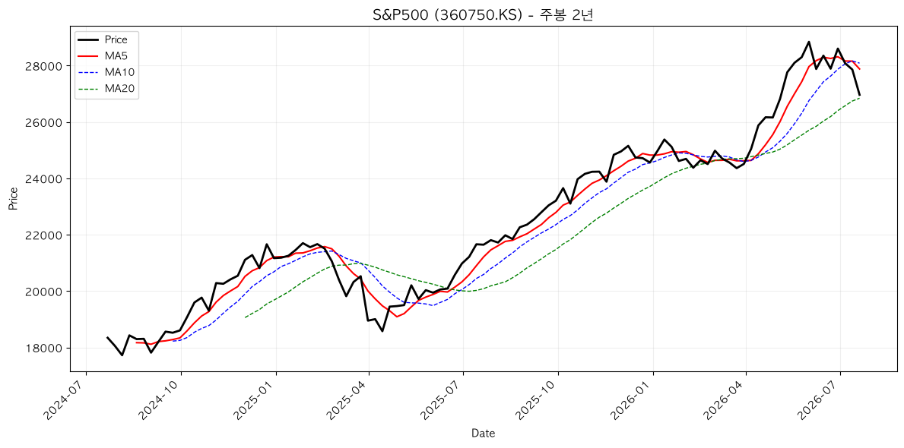
**분석**: 정배열 유지하며 상승 추세 진행 중. 단기 약세 신호도 있으나 중기 추세는 여전히 강세. 지속적인 고점 경신 중.

#### 미국배당다우존스 (446720.KS)
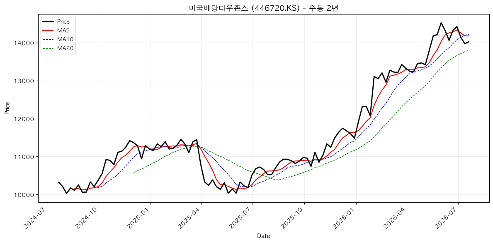
**분석**: 혼조 배열로 변경되고 있으며 약세 신호 가시화. 이전 고점 대비 조정 국면 진입.

#### 미국나스닥100 (133690.KS)
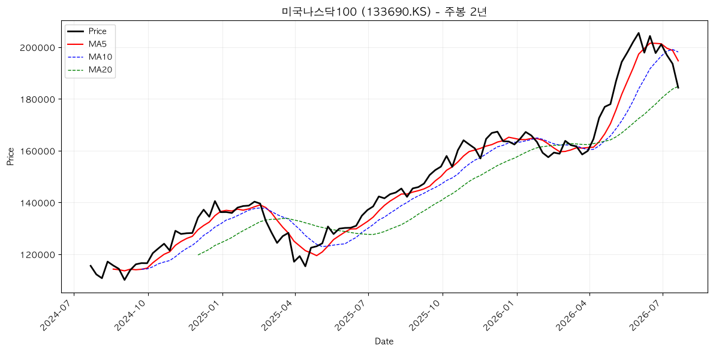
**분석**: 강한 정배열을 유지하며 지속적인 상승. 지난 2개월간 45% 이상 상승으로 과열권 진입.

### 국내/혼합 자산군

#### 키움200TR (294400.KS)
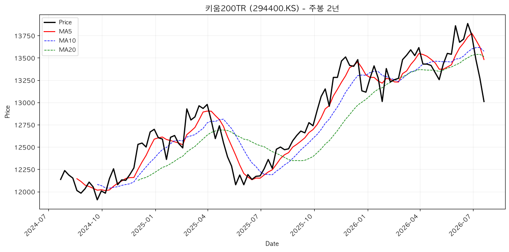
**분석**: 혼조 배열로 방향성 불명. 보합 진행 중으로 추가 신호 대기.

#### KODEX200미국채혼합 (284430.KS)
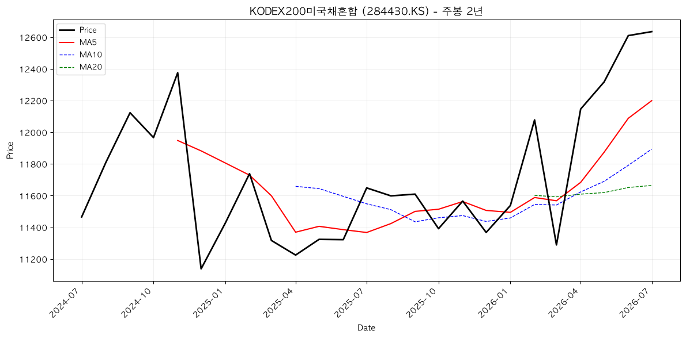
**분석**: 혼조 배열 지속, 보합권 진행. 주식·채권 혼합이 변동성 완화.

#### SOL조선Top3 (466920.KS)
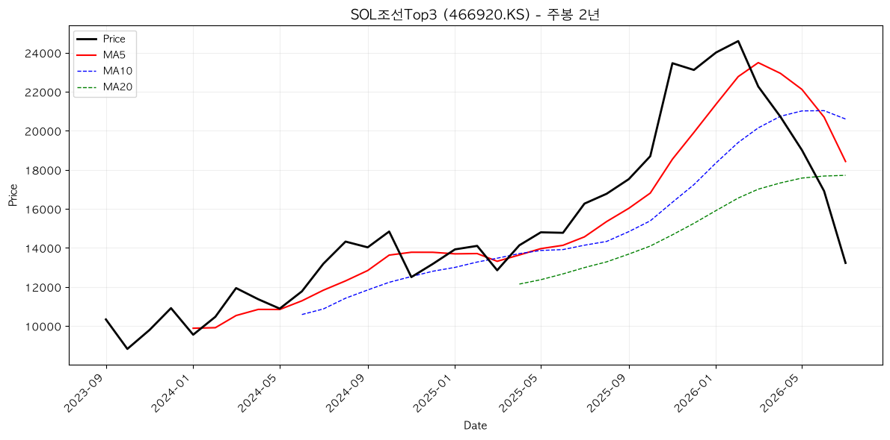
**분석**: 보합권 진입, 혼조 배열. 산업 사이클 약세 국면 지속.

### 배당 자산군

#### 은행고배당Top10 (466940.KS)
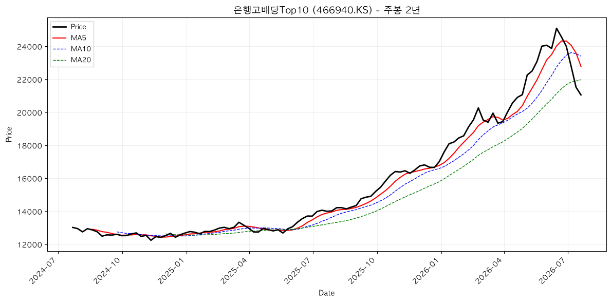
**분석**: 혼조에서 약세 전환 중. 이자율 불확실성과 금리 역행 우려로 약세 신호 발생.

### 채권/안전자산

#### 미국채10년 (305080.KS)
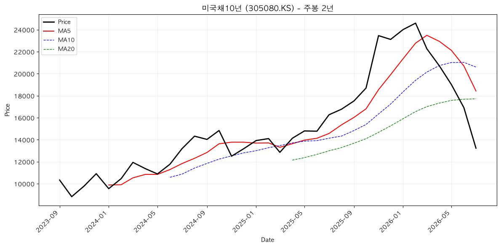
**분석**: 역배열 형성으로 약세 진행. 금리 상승기 채권 약세 전개.

#### US리츠 (352560.KS)
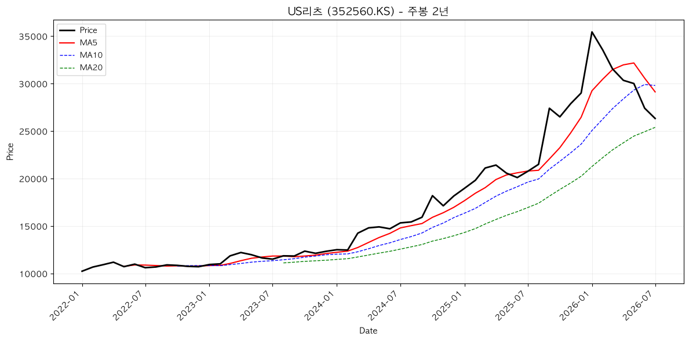
**분석**: 역배열 강화, 약세 심화. 고금리 장기화로 부동산펀드 약세 지속.

#### 금 (411060.KS)
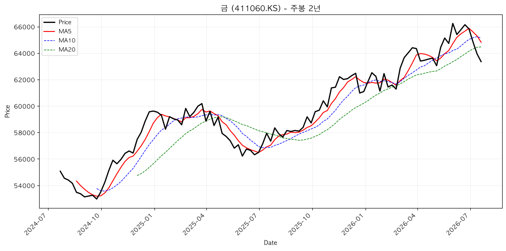
**분석**: 혼조 배열 유지, 방어 자산으로 횡보. 지정학 리스크 대비 상대적 강세.

### 통화/인프라

#### 미국달러SOFR (456610.KS)
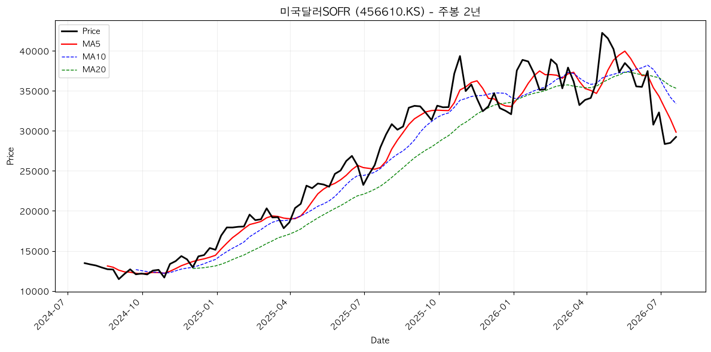
**분석**: 혼조 배열, 변동성 높음. 글로벌 금리 변동에 민감.

### 기술/AI 자산군

#### ACE글로벌반도체Top4 (446770.KS)
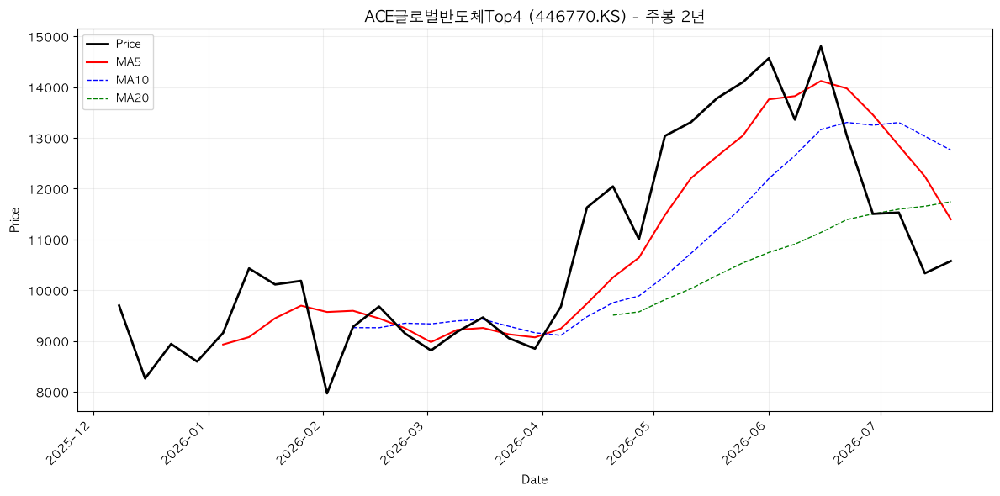
**분석**: 역배열 강화, 약세 심화. 반도체 사이클 조정 진행.

#### 미국AI전력핵심인프라 (487230.KS)
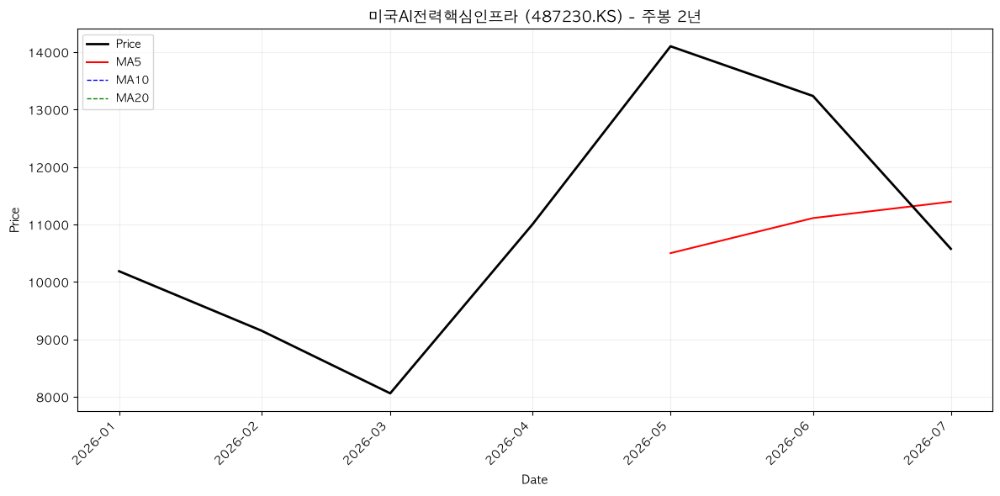
**분석**: 역배열 형성, 약세 진행. AI 버블 조정 과정으로 보임.

#### 미국AI데이터센터 (0142D0.KS)
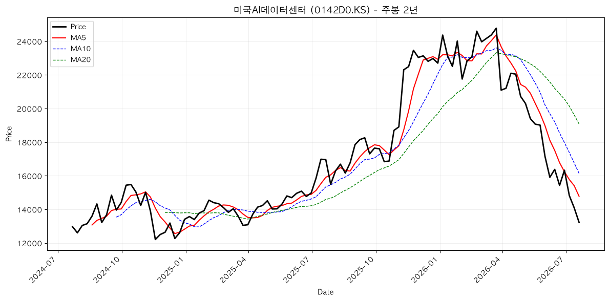
**분석**: 혼조 배열로 조정 국면. 단기 하락 후 바닥 가능성 높음.

#### KoAct바이오헬스케어 (462900.KS)
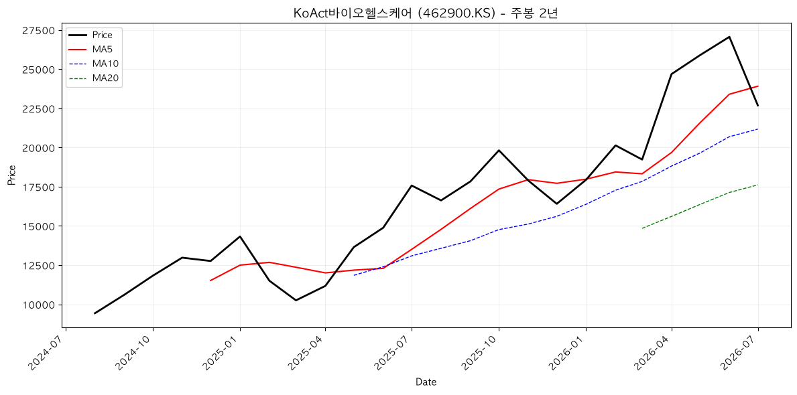
**분석**: 혼조에서 조정 진행 중. 상승장 조정 국면이나 중기 추세는 강세 유지.

---

## 5. 추세추종 관점 주목 종목

### 🚀 멀티타임 정배열 (강한 상승 신호)
- **360750.KS (S&P500)**: 주봉·월봉 모두 정배열 유지, 지속 상승 가능성 높음
- **133690.KS (미국나스닥100)**: 강한 정배열로 최고 강도 상승 신호, 과열권이나 추세 연장 가능

### ⚠️ 혼조 관망 (신호 대기)
- **294400.KS (키움200TR)**: 혼조 배열, 명확한 방향 신호 전까지 관망
- **284430.KS (KODEX200미국채혼합)**: 혼합 자산으로 변동성 낮음, 안정 추구시 적합
- **411060.KS (금)**: 방어 자산으로 횡보, 리스크 헤지 용도 가치 있음
- **456610.KS (미국달러SOFR)**: 변동성 높지만 명확한 추세 미형성

### 🔻 멀티타임 역배열 (약세 신호)
- **305080.KS (미국채10년)**: 역배열 형성, 금리 상승 환경에서 약세 지속 가능
- **352560.KS (US리츠)**: 강한 역배열, 부동산 약세 심화 신호
- **446770.KS (ACE글로벌반도체Top4)**: 역배열 강화, 반도체 조정 심화 신호
- **487230.KS (미국AI전력핵심인프라)**: 역배열 형성, AI 버블 조정 신호

### 📌 눌림목 매수 후보
- **0142D0.KS (미국AI데이터센터)**: 혼조에서 조정 중, 바닥 가능성 있음
- **446720.KS (미국배당다우존스)**: 약세 전환 초기, 추가 조정 가능성
- **462900.KS (KoAct바이오헬스케어)**: 상승 추세 조정 단계, 반등 기대
- **466940.KS (은행고배당Top10)**: 약세 초기, 바닥 탐색 중

---

## 6. 자산군별 추세 비교

### 미국 선진주식 vs 국내 KOSPI
미국 선진주식(S&P500, 나스닥)은 강한 상승세를 지속하는 반면, 국내 KOSPI 연동 ETF(키움200TR, SOL조선)는 약세 또는 보합권에 머물러 있습니다. **미국 중심 상승장의 특징**이 두드러집니다.

### 성장주(나스닥) vs 가치주(배당)
나스닥은 계속 신고점을 경신하고 있으나, 미국배당다우존스와 은행고배당Top10은 약세로 전환했습니다. **성장주 vs 가치주의 성과 차이**가 확대 중입니다.

### 채권 약세 심화
미국채10년(305080.KS)과 혼합채권(284430.KS) 모두 약세 또는 보합을 나타냅니다. **금리 상승장 장기화**의 신호입니다.

### 대체자산 양분화
- **금(411060.KS)**: 방어 자산으로 횡보, 지정학 리스크 대비 수요 지속
- **리츠(352560.KS)**: 고금리 장기화로 급락, 부동산 투자 약세

### 기술/AI 자산의 조정
반도체, AI 기반 ETF들이 동시 약세로 **섹터 조정장** 진행 중입니다. 특히 최근 폭등한 AI 관련 종목들의 이익실현 매도로 보입니다.

---

## 7. 종합 코멘트

### 현 상황 진단
2026년 7월 3주(보고 기준 7월 20주)는 **미국 선진주식의 강세와 기타 자산의 조정이 공존**하는 양극화된 시장입니다.

### 추세추종 대응 방향

1. **강세 자산 추종** (S&P500, 나스닥)
   - 정배열 유지하며 상승 추세 진행, 추가 고점 경신 가능
   - 추종 매수 기조 유지, 단기 조정 시 매수 기회로 활용

2. **약세 자산 회피** (채권, 리츠, 반도체)
   - 역배열 심화로 하락 추세 확인, 추가 약세 가능성
   - 공매도 고려 또는 진입 연기

3. **혼조 자산 관망** (배당주, 혼합자산, AI 조정 중)
   - 명확한 추세 신호 전까지 진입 제한
   - 바닥 형성 신호(이중저 등) 대기

4. **방어 자산 소량 편입** (금, 혼합채권)
   - 리스크 헤지 목적으로 소량 유지
   - 시장 변동성 급증시 수요 증대

### 향후 주목할 이벤트
- 연방준비제도(FRB) 금리 인상 신호 해제 여부
- AI 수익화 실적 발표 및 멀티플 조정
- 지정학 리스크 발현 여부 (영향: 금, 달러)

### 추세추종 전략 요약
**강한 상승 자산(나스닥, S&P500)은 매수 유지하되 과열권 경고, 약세 자산(채권, 리츠, 반도체)은 회피, 혼조 자산은 추세 확인 후 신규 진입 시점 판단.**

---

## 면책 조항
본 리포트는 **투자 자문이 아니며**, 기술적 분석을 바탕한 추세 설명입니다. 투자 결정은 투자자의 개인적 상황, 위험 선호도, 장기 목표를 종합 고려하여 금융 전문가 상담 후 결정하시기 바랍니다. 과거 추세가 미래 수익을 보장하지 않습니다.

## 5. 내 ETF 평가 & 대응

현재 포트폴리오는 반도체 약세와 금리 인상 환경에서 **방어적 자산 비중 강화**가 필요한 시점입니다.

### 평가 요약

**한국 자산 (금리 인상 수혜)**
- 은행고배당 ETF: 기준금리 인상(2.75%)으로 순이자마진 증가 → 강세 신호
- 코스피 관련: 반도체 약세에도 금융주 방어로 상대적 강세 유지

**미국 자산 (금리 인하 영향)**
- S&P500: 영가익 높으나 마진데빗 극고점으로 조정 위험 → 보유 재검토
- 나스닥: 상대적 강세지만 고평가 → 신규 진입 신중
- 미국채: 금리 인하 가능성 → 장기 보유 권장

**대안자산**
- 금: 위험회피 수요 + 금리인하 기대 → 5~10% 방어 비중 유지
- 달러: 원화 약세에 대한 헤징용 → 10% 이상 보유 필요

### 포트폴리오 리밸런싱 방향
1. 현금 유동성 유지 (조정 기회 포착용) → 5% 이상
2. 고금리 수혜 기업 (한국 금융) → 비중 확대
3. 장기채권 진입 타이밍 → 9월 FOMC 이후

## 6. 종합 코멘트 & 다음 주 관전 포인트

### 핵심 평가
- 한국과 미국의 금리 정책 방향이 분기하고 있습니다. 한국은 금리 인상 추세가 지속되는 반면, 미국은 하반기 인하 가능성이 높아지고 있습니다.
- 마진데빗이 사상 최고점을 기록했으며, 이는 시장 조정 위험이 높다는 신호입니다.
- 차트는 미국 주식 중심의 혼조강세를 유지하지만, 장기채권과 국내 지수는 약세를 보이고 있습니다.

### 다음 주 관전 포인트
1. **미국 인상률 결정** (9월 예상) - PCE와 NFP 지표 주목
2. **한국 소비자물가** (월말) - 물가 고착화 여부 판단  
3. **마진데빗 추이** - 시장 조정 신호 확인

### 포트폴리오 대응
- 현금 유동성 유지 (조정 기회 포착용)
- 고금리 내성 기업 우선 (한국 금융, 에너지)
- 달러/금 비중 유지 (방어 수요)

## 면책 문구

본 글은 정보 제공 및 개인 기록 목적이며 투자 자문이 아닙니다. 투자 판단과 책임은 본인에게 있습니다.
