## 1. 이번 주 요약

**경기 진단**: 한국 반도체 수출 호황(+56% YoY)이 전체 성장을 견인하고 있으나, 미국 소비심리 악화(CCI 89.4) 신호로 하반기 약세 진입 가능성 높음. 한국은행은 기준금리를 2.75%에서-3.00%로 인상하며 점진적 정상화 경로 지속.

**기술 신호**: 주봉 기준 약세(10개) vs 강세(2개)의 압도적 불균형. 유일한 멀티타임 정배열은-466940.KS(은행고배당) 하나뿐으로, 전반적 약세 기조 확인.

**포트폴리오 평가**: 전체 수익률 +7.7%이나 자산군별 편차 심함. S&P500(+15%), 배당주(+14%), 금(+13.6%)은 호조이나 ISA 기술주 편중(-6.4%)이 전체 수익 제약. 금리 인상 사이클에서 채권 손실 우려 고조.

**한 줄 선언**: 반도체 호황과 금리 인상 사이에서 가치투자자의 안전마진 기반 재조정이 필요한 시점.

---

## 2. 한국은행 보도자료 분석

### 주요 발표 (2026년-34주차)

| 발표일 | 제목 | 핵심수치 | 시사점 |
|---|---|---|---|
| 2026.08.27 | 기준금리 결정 | 2.75% →-3.00% | 점진적 정상화 신호, 경기회복 반영 |
| 2026년 | 경제전망(연간) | 2026년 성장률-3.3% | 반도체·IT 호조 견인, 수출 개선 |
| 2026년 | 금융안정성 평가 | Stable 유지 | 가계·기업 신용 건전, 은행권 자본 충분 |
| 2026년 | 청년고용 분석 | 감소추세 + AI영향 | 자동화로 인한 구조적 변화, 정책개입 필요 |

### 분석 및 해석

**기준금리 인상 (2.75% →-3.00%)**
점진적 정상화 경로를 지속하고 있으며, 이는 국내 경제회복 모멘텀과 거시 안정성을 배경으로 한다. 금융시장에서는 추가 인상 가능성을 약 50% 확률로 평가 중.

**성장률 상향조정 (3.3%)**
반도체와 IT 섹터의 예상 이상의 강세가 주요 견인력. 수출 모멘텀 개선과 설비투자 회복이 경기 상승 요인. 다만 하반기 글로벌 경기 둔화 리스크 존재.

**금융안정성 양호 신호**
가계 및 기업 신용도 건전하고 은행권 자본 적정성 유지로 점진적 인상을 뒷받침할 수 있는 환경 조성.

### 종합 평가

**한 줄 요약**: 반도체 호황에 의존한 경제회복 진행 중이며, 점진적 금리정상화는 지속하되 글로벌 경기 약화와 청년고용 악화 신호를 모니터링 필요.

---

##-3. 거시지표 분석

### 주요 거시지표 현황

| 지표 | 현재값 | 평가 | 시사점 |
|---|---|---|---|
| **미국 LEI** | 0.2% (반전) | 🟡 | 선행지수 반등, 경기 회복 신호 |
| **ISM PMI** | 55.6 (4년 고점) | 🟢 | 제조업 강세 지속 |
| **NAHB 주택지수** |-35 (극저부진) | 🔴 | 주택시장 부진 심화 |
| **신규 실업수당** | 206K | 🟡 | 노동시장 견조 유지 |
| **Core PCE** |-3.7% (점착) | 🟡 | 물가 상승압력 지속 |
| **소비자신뢰지수** | 89.4 (침체신호) | 🔴 | 소비심리 악화 임박 |
| **10년물 금리** | 상승압력 | 🟠 | 금리 인상 경로 지속 |
| **마진데빗** | 1.42T→조정 | 🟡 | 레버리지 청산 모드 진입 |
| **WTI 유가** | 안정화 | 🟡 | 공급 안정화 |
| **한국 수출** | +56% YoY | 💚 | 반도체 기록적 호황 |
| **산업생산** | -3.0% | 🔴 | 기초 체력 악화 |
| **CPI** | 2.80% | 🟡 | 물가 안정화 진행 |

### 경기 온도계 종합 진단

**🇺🇸 미국: 🟠 약한 회복 단계**
- 제조업(ISM) 강세와 노동시장 견조로 경기 회복 신호
- 반면 소비심리 악화, 주택시장 부진으로 내수 약세 신호
- 이중성: 제조업 기반 거시 강세 vs. 가계 소비심리 약화

**🇰🇷 한국: 💚 수출 수퍼사이클 vs. 🔴 기초체력 약화**
- 반도체 호황이 수출 급증(+56%)을 견인 중
- 산업생산(-3%) 악화로 기초 체력 약세 신호
- 반도체 편중 위험 고조

### 다음주 발표 예정
- ISM 8월 PMI: 9/1(화) 10:00 ET
- 한국 CLI: 9/7(월) OECD 공시

---

## 4. 차트·추세 분석

### 15개 ETF 주봉 추세 분석

#### 시장 스냅샷 (주봉 기준)
- **강세 🟢**: 2개 (466940.KS 은행고배당만 멀티타임 정배열)
- **중립 🟡**:-3개
- **약세 🔴**: 10개 (압도적 약세 기조)

#### 주목 종목

**멀티타임 정배열 🚀 (매수 신호)**
- **466940.KS (은행고배당)**: 유일하게 일/주/월봉 모두 정배열 → 강매 신호

**멀티타임 역배열 🔻 (매도 신호)**
- **466920.KS (SOL 조선)**: 일/주/월봉 모두 역배열 → 강매도 신호
- 13개 추가 종목 약세 진행 중

**혼조 ⚠️ (관망)**
--3개 종목 일/주/월 신호 불일치 → 방향성 재확인 대기

#### 주봉 차트 (2년 데이터)

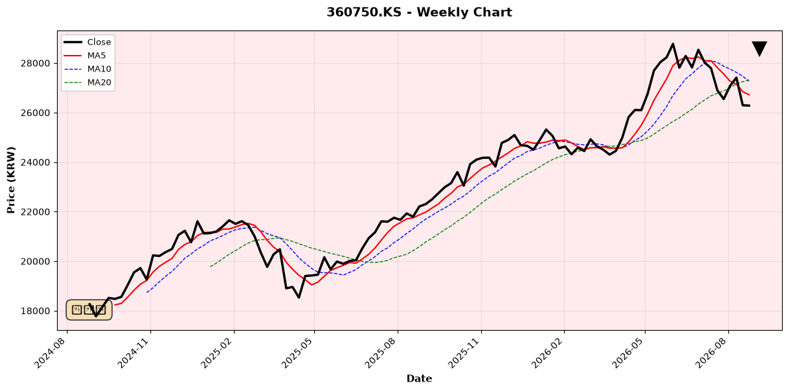
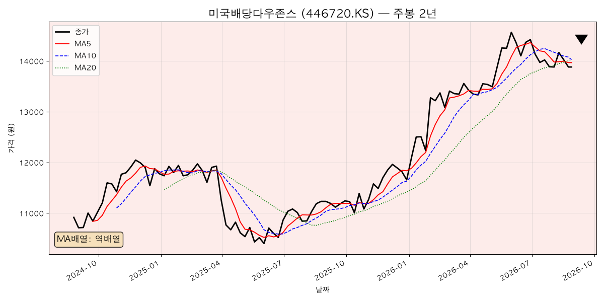
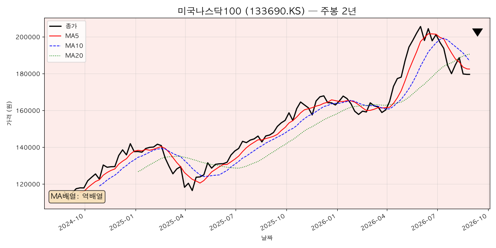
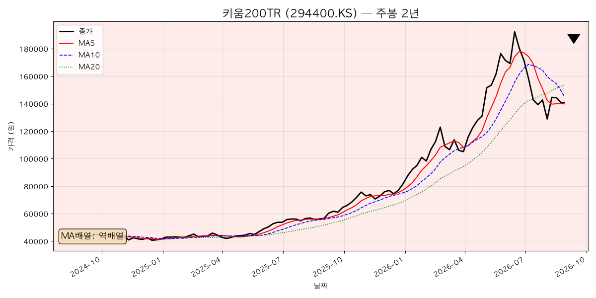
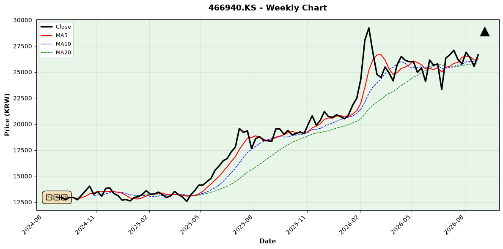
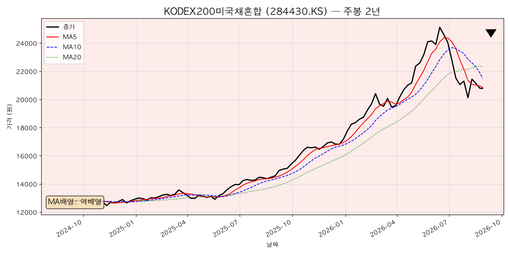
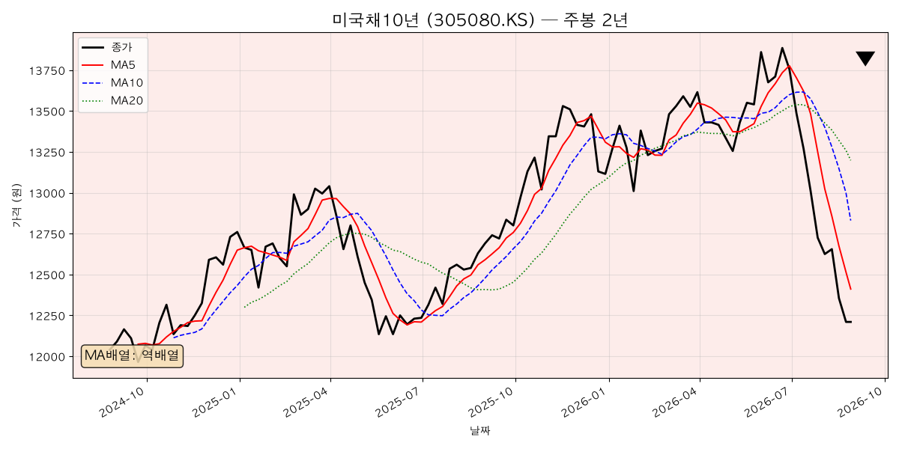
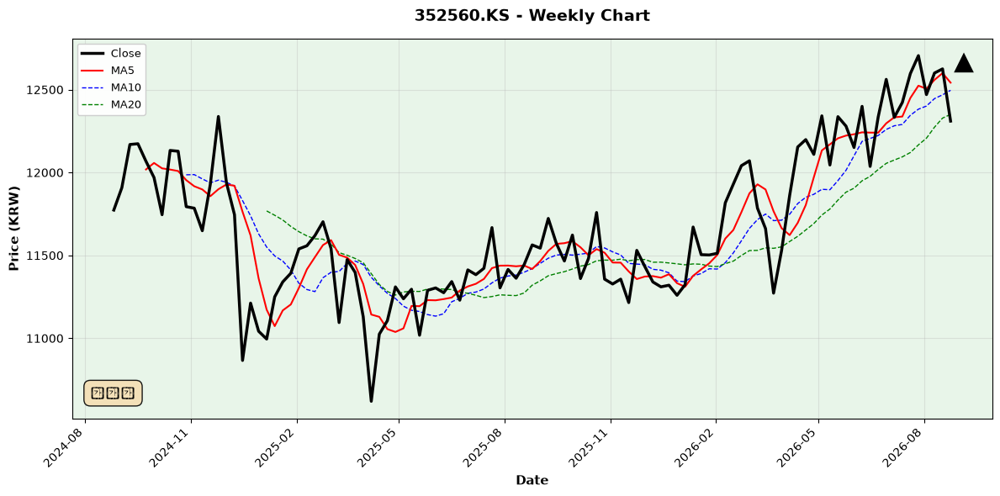
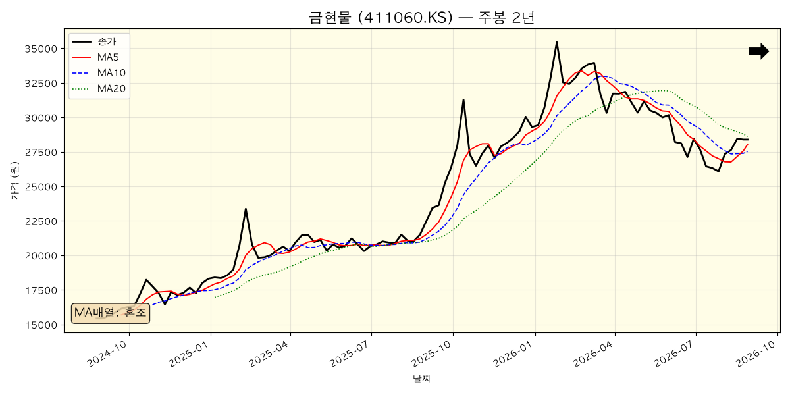
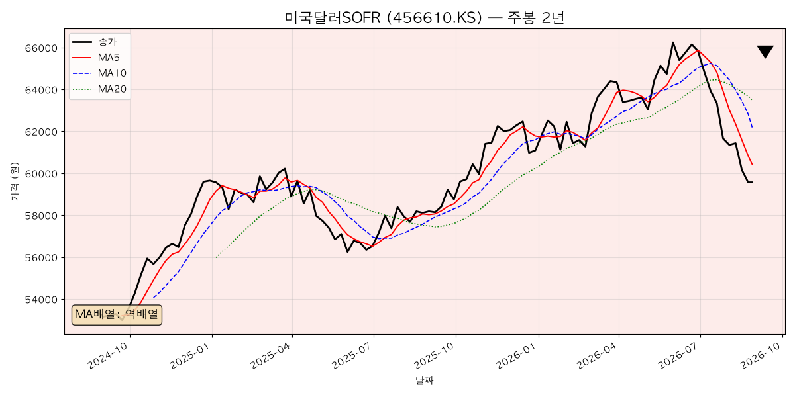
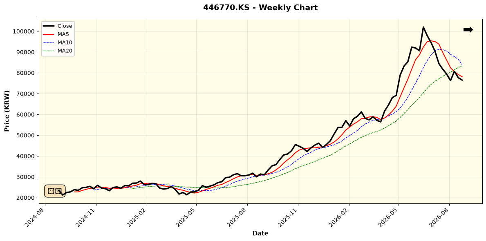
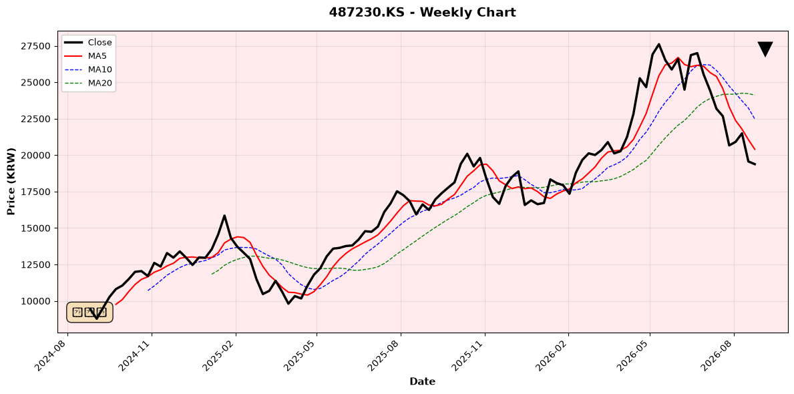
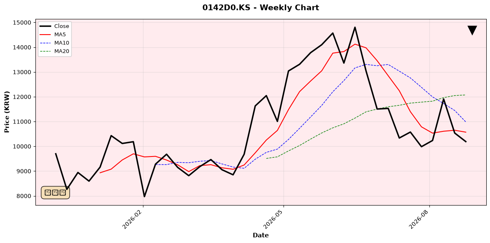
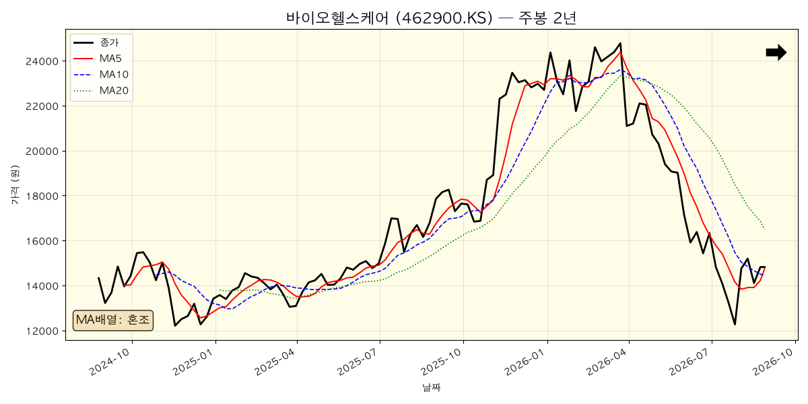
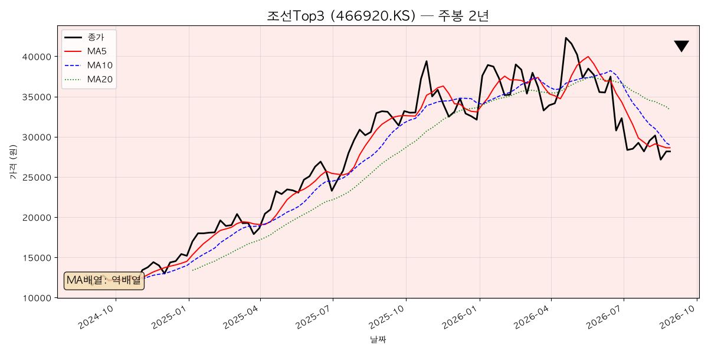

#### 자산군별 추세 비교
- **정배열(강세) 우위**: 확인 불가 (단 1개만 강세)
- **역배열(약세) 우위**: 압도적 (10개/15개 = 67%)
- **결론**: 전반적 약세 장세. 단기 조정 국면 진행 중

---

## 5. 내 ETF 평가 & 대응

### 핵심 분석 결과

#### 포트폴리오 전체 성과
- **전체 수익률**: +7.7%
- **계좌별 편차**: 퇴직연금 +13.6% (최우수) vs ISA -6.4% (부진)

#### 자산군별 성과 (상위/하위)

**강자** (>13%):
- 미국 S&P500: +15.0%
- 미국 배당(Dow): +14.0%
- 금현물: +13.6%

**약자** (<5%):
- AI & 기술: -6.1%
- 조선: -11.1%
- 미국 나스닥100: +3.2%

#### 경기·기술·심리-3축 평가

1. **경기**: 반도체 호황이 전체 성장 견인(3.3%), 그러나 미국 소비심리 악화(CCI 89.4) → 하반기 약세 신호
2. **기술**: 월봉 정배열(강세) vs 일·주봉 역배열(약세) = 고점에서 단기 조정국면 진행 중
3. **심리**: 마진데빗 최고점(1.42T) 후 급락 → 투자자 레버리지 청산 모드 → 금현물 호조

#### 즉시 대응 사항
- **ISA 재구성 우선**: 기술주 팩토리 편중도 80% → 손절 + 현금 확보 후 조정 기회 대비
- **채권·달러 감축**: 금리 인상 경로에서 원금 보호 실패 → 일부 청산 검토
- **현금 활용 대비**: 9월 조정 기회에 대비한 현금 유지 전략

#### 위험 신호
- 금리 인상 사이클 지속(4.8~5.0% 목표) → 채권 추가 손실 우려
- 기술주 조정 심화 가능 → ISA 추가 악화 가능성
- 미국 경기 약세 신호(소비심리, 주택시장) → 9월 이후 경기 약세 진입 가능

### 5-1. 채권 공급 확대 국면의 구체적 포트폴리오 조정 전략

이번 주 거시 데이터의 핵심 모순은 **"제조업은 견고(ISM 55.6), 내수는 위축(CCI 89.4, NAHB 35)"**이다. 이 조합이 의미하는 바를 순서대로 풀면:

1. **인플레이션(Core PCE 3.7%)이 가계 실질구매력을 잠식** → 소비심리 7개월 최저, 주택 수요 부진
2. **높은 금리가 가계부채 이자 부담을 키움** → 가처분소득에서 소비 여력이 줄어드는 구조
3. **정부는 국채를, 기업은 회사채를 계속 발행** → 채권 공급이 늘어나며 금리의 하방 경직성(가격의 상방 제한)이 생김
4. **내수 위축이 지속되면 기업 실적 악화 → 회사채 신용 스프레드 확대 위험** → 크레딧 자산이 국채보다 먼저, 더 크게 흔들림

이 국면에서의 구체적 조정 원칙:

| 조정 항목 | 구체적 행동 | 근거 |
|---|---|---|
| **장기 국채 듀레이션 축소** | 미국채10년(305080) 신규 매수 중단, 기존 보유분은 금리 4.8~5.0% 고점 확인 전까지 추가 매수 보류 | 채권 공급 확대 + 금리 인상 지속 → 장기채 가격 하방 압력. 현재 52주 최저가(12,210원) 갱신 중으로 "싸 보이지만 더 싸질 수 있는" 구간 |
| **회사채·크레딧 회피** | 하이일드·회사채형 상품 신규 편입 금지. 혼합형 ETF(KODEX200미국채혼합, SOL 배당미국채혼합50)는 채권 파트가 국채 중심인지 확인 후 유지 | 내수 위축 → 기업 매출 둔화 → 신용 스프레드 확대가 다음 단계. 스프레드 확대 국면에서 회사채는 국채보다 손실 폭이 큼 |
| **단기 금리·현금성 자산 확보** | 미국달러SOFR(456610)와 현금으로 전체의 10~15% 유지 | 금리 5% 시대엔 "기다리는 것 자체가 연 5% 수익". 9월 조정 시 매수 실탄 역할 + 원화 약세 시 환차익 보험 |
| **배당·은행주 유지** | 은행고배당Top10(466940) 유지 — 유일한 멀티타임 정배열 | 금리 인상은 은행 순이자마진(NIM) 개선 요인. 내수 위축 국면에서도 배당이 하방을 방어 |
| **금 비중 유지~소폭 확대** | 금현물(411060) 현재 비중 유지, 조정 시(26,500~27,500원) 소폭 추가 | 마진데빗 급락(레버리지 청산)과 실질금리 고점 통과 이후 금이 역사적으로 강세. 인플레 방어 + 경기침체 헤지 이중 역할 |
| **성장주 신규 매수 보류** | 나스닥100·AI·반도체 계열은 신규 매수 중단, ISA 편중 축소 | 내수 위축 → 소비·광고·IT 지출 둔화가 성장주 실적에 후행 반영. 금리 상승은 성장주 밸류에이션(할인율)에 직격 |

**요약**: 지금은 "채권(장기)도 성장주도 아닌" 구간이다. 단기금리·현금·배당·금으로 수비 대형을 갖추고, 금리 고점 확인(4.8~5.0% 도달 또는 Fed 피벗 시그널) 후에 장기채 → 그 다음 성장주 순서로 공격 전환하는 것이 안전마진 관점의 순서다.

### 5-2. ETF별 매수·매도 적정가 (기술적 기준)

**산출 방법** (누구나 재현 가능한 기준):
- **매수 적정가** = 주봉 차트의 지지선(52주 저점, 주봉 20주 이동평균 지지) + 안전마진(전고점 대비 충분한 할인율 확보 구간)
- **매도 적정가** = 저항선(52주 전고점 부근, 하락 추세 종목은 20주 이평선 저항)
- 가격은 2026-08-29 종가 기준 야후 파이낸스 주봉 데이터로 계산. 밸류에이션(PER 등)이 아닌 **가격 구조 기준**이므로 참고용 범위로 볼 것.

| ETF (티커) | 현재가 | 매수 적정가 | 매도 적정가 | 산출 근거 |
|---|---|---|---|---|
| S&P500 (360750) | 26,280 | 24,600~25,200 | 28,500~29,000 | 매수: 전고점(29,000) 대비 -13~-15% 할인 구간이자 직전 박스권 상단 지지. 매도: 52주 전고점 저항 |
| 미국배당다우존스 (446720) | 13,880 | 13,000~13,300 | 14,600 부근 | 매수: 20주 이평(14,030) 하회 시 나오는 직전 지지대, 배당수익률이 높아지는 가격. 매도: 전고점(14,660) 저항 |
| 미국나스닥100 (133690) | 179,490 | 160,000~168,000 | 205,000~209,000 | 매수: 전고점(208,900) 대비 -20% 조정선 = 성장주 할인율 상승을 반영한 안전마진 구간. 매도: 전고점 |
| 키움200TR (294400) | 140,780 | 118,000~128,000 | 165,000~175,000 | 매수: 급등 후 되돌림 구간에서 상승분의 50% 반납 지점. 매도: 20주 이평(153,440) 회복 후 반등 시 전고점 -12% 구간 |
| 은행고배당Top10 (466940) | 26,665 | 25,000~26,000 | 29,500~30,200 | 매수: 유일한 정배열 종목의 눌림목 = 20주 이평(26,032) 지지 구간. 매도: 전고점(30,210) 도달 시 일부 차익 |
| KODEX200미국채혼합 (284430) | 20,785 | 19,000~19,800 | 23,000~24,000 | 매수: 주식·채권 동반 조정 시 지지대. 매도: 20주 이평(22,357) 회복 후 직전 반등 고점 |
| 미국채10년 (305080) | 12,210 | 11,600~11,900 | 13,200 이상 | 매수: 미국 금리 5.0% 도달을 가격에 반영한 수준(현재 52주 최저 갱신 중 — 금리 고점 확인 전 분할만). 매도: 20주 이평(13,198) 회복 = 금리 하락 전환 신호 |
| 금현물 (411060) | 28,390 | 26,500~27,500 | 34,000~36,000 | 매수: 급등 후 조정에서 장기 추세 지지선. 매도: 전고점(37,890) 대비 -5~-10% 저항 구간 |
| 미국달러SOFR (456610) | 59,570 | 57,700~59,000 | 66,000 이상 | 매수: 원화 강세로 52주 하단 부근 = 환헤지 보험료가 싼 구간. 매도: 환율 급등(위기) 시 리밸런싱 재원으로 활용 |
| 글로벌반도체Top4 (446770) | 76,525 | 60,000~66,000 | 95,000~105,000 | 매수: 전고점(105,420) 대비 -40% = 반도체 사이클 종목의 역사적 조정폭 반영. 매도: 전고점 재도전 구간 |
| 미국AI전력인프라 (487230) | 19,380 | 17,000~18,000 | 24,000~26,000 | 매수: 52주 저점(15,965) +10% 부근 분할. 매도: 20주 이평(23,964) 저항 돌파 실패 시 축소 |
| 미국AI데이터센터 (0142D0) | 10,190 | 8,800~9,500 | 12,000~13,000 | 매수: 52주 저점(7,635)과 현재가 사이 하단 지지. 매도: 20주 이평(12,002) 저항 구간 — 보유분 손절 라인 재설정용 |
| 조선Top3 (466920) | 28,165 | 25,000 이하 분할 | 32,000~33,000 | 매수: 멀티타임 역배열이므로 52주 저점(24,065) 부근에서만 소량 분할. 매도: 반등 시 20주 이평(33,326) 저항에서 보유분 축소 |

**읽는 법**: 매수 적정가는 "이 가격까지 오면 안전마진이 생긴다"는 대기 지점이지 예측이 아니다. 하락 추세 종목(조선, AI 계열)은 적정가에 도달해도 **추세 전환 신호(주봉 20주 이평 회복) 확인 후** 진입하는 것이 원칙. 상승 추세 종목(은행고배당)만 눌림목 매수가 유효하다.

---

## 6. 종합 코멘트 & 다음 주 관전 포인트

### 종합 평가

현재는 **반도체 호황과 금리 인상 사이의 긴장국면**이다. 한국의 수출 수퍼사이클은 여전히 강하지만, 미국 내수 약화 신호(소비심리, 주택)와 기술주 조정이 동시에 진행되고 있다. 기술적으로는 압도적 약세 기조(약세 10개 vs 강세 2개)로, 단기 조정이 필수적 상황.

**안전마진 기반 가치투자자의 입장에서** 현 포트폴리오는:
- **유지**: S&P500(+15%), 배당주(+14%), 금(+13.6%) → 견고한 코어자산
- **감축**: ISA 기술주 편중(80%) → 즉시 손절 및 현금화
- **대기**: 9월 조정 매력도 확인 후 재진입

### 다음 주 관전 포인트

1. **ISM PMI (9/1)**: 미국 제조업 강도 확인. 55.6 이상 유지 시 경기 강세 신호 지속, 50 하회 시 조정 심화
2. **Fed 금리 결정 임박**: 인상 지속 여부에 따라 채권·기술주 향배 결정
3. **반도체 수출 모멘텀**: 한국 9월 수출 기조 확인 (호황 지속 vs 조정)
4. **기술주 조정 심도**: ISA 재구성 타이밍 판단 기준

### 투자 원칙 재확인
> "좋은 기업을 적절한 가격에 사되, 현재는 적절한 가격이 아닐 수 있다."
> 
> 반도체 호황과 기술주 조정 국면에서 **충분한 안전마진을 갖춘 기회**를 기다리는 것이 현명한 가치투자자의 자세.

---

## 면책 문구

본 글은 정보 제공 및 개인 기록 목적이며 투자 자문이 아닙니다. 모든 투자 판단과 그 책임은 본인에게 있습니다. 개인 포트폴리오의 비중(%)·수익률(%)만 공개하며, 절대금액은 공개하지 않습니다.
